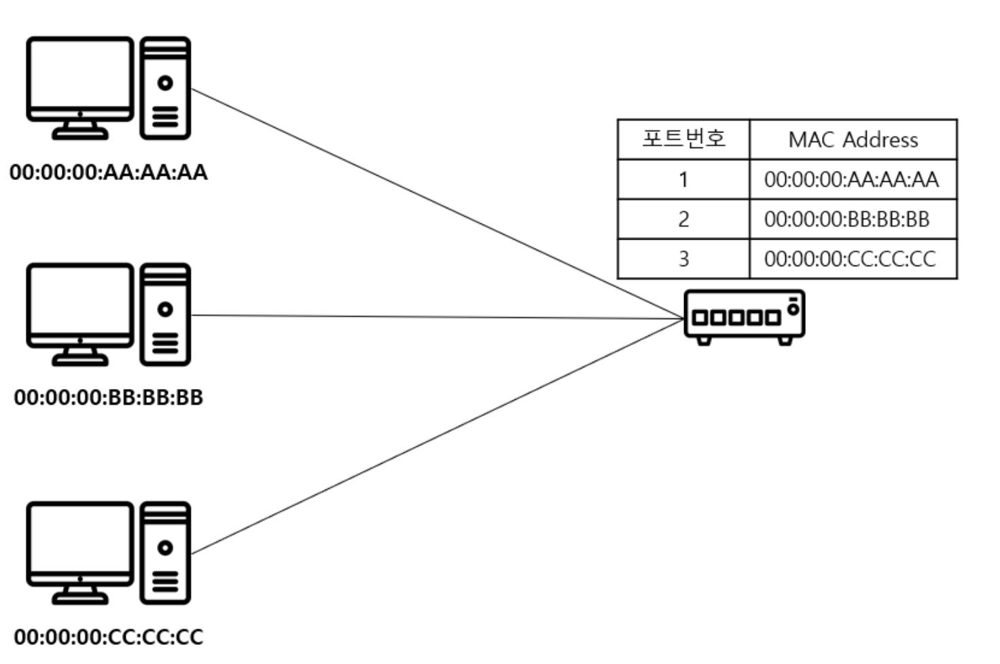

# 네트워크 기본

## 네트워크
- 서로 통신할 수 있는 상호 연결된 디바이스의 집합
- 네트워크가 생겨난 계기는 데이터를 주고받기 위해서다
- 상대방에게 요청해서 응답을 받는 것이 네트워크의 핵심

### LAN(Local Area Network)
* 
* 근거리 통신망
* 일반적으로 하나의 사무실 또는 주택 내의 네트워크
* 전체적인 통신망에서 가장 하위에 속하는 것Q
* 소규모의 특정 영역 내에서 컴퓨터와 기타 장치를 연결하는 네트워크
* 랜카드(NIC)와 랜케이블(이더넷 케이블)이 필요
* 고속 연결: 
  * LAN은 작은 영역을 커버하기 때문에 일반적으로 고속 연결을 제공하여 장치 간 빠른 데이터 전송이 가능
* 작은 지리적 영역: 
  * LAN은 일반적으로 단일 건물이나 인근 건물 그룹으로 제한
* 리소스 공유: 
  * LAN의 주요 장점 중 하나는 장치가 리소스를 공유할 수 있다는 것
  * 여러 컴퓨터가 동일한 프린터를 사용하거나 중앙 서버에 저장된 동일한 파일에 액세스

## 장치

- 각 계층의 장비들은 각 계층에 도달한 캡슐화된 데이터를 장치가 해석할 수 있는 계층까지 역캡슐화하여 프로토콜의 내용을 확인하고 경로를 설정해주는 장치

### Hub(허브)
* 연결되는 컴퓨터가 많아질수록 이들이 각각 모두 연결되는 것은 불가능
* 

* 아래처럼 중앙에 연결장치(허브)를 두게됨.
* 

*  LAN(Local Area Network)에서 여러 컴퓨터나 네트워크 장치를 함께 연결하는 기본 네트워킹 장치
*  OSI 모델의 물리 계층(**1계층**)에서 작동
*  한 장치로부터 데이터 패킷을 수신하고 이를 네트워크 내 **연결된 다른 모든 장치**에 브로드캐스트
*  현대에는 스위치로 대체됨

### 스위치
* 
* LAN(Local Area Network) 내에서 여러 장치(예: 컴퓨터, 프린터, 서버)를 연결하고 이들 장치 간의 데이터 트래픽을 지능적으로 연결하는 네트워킹 장치
* 특징
  * 데이터 패킷을 수신하면 모든 장치에 브로드캐스트하는 것이 아니라 **대상 수신 장치에 연결된 포트에만 전달**
  * 또한 데이터의 방향 전환이 가능해짐
  * 스위치가 생기면서 프로토콜에 특정 컴퓨터를 지정하는 정보가 추가됨.
* 허브와 달리 스위치는 OSI 모델의 데이터 링크 계층(**2계층**)에서 작동  
  * 
  * 이더넷 프로토콜을 사용하여 장치 검색
  * 각 컴퓨터들은 스위치 **포트**에 케이블로 연결되어 있음
  * 포트와 MAC 주소가 매핑되어 있는 **MAC 주소 테이블**을 메모리에 가지고 있음
  * 

### 라우터 
* LAN을 서로 잇기 위해서 어떻게 해야 할까 ? 
* 각 LAN의 스위치를 잇는 방법 
  * 스위치가 늘어날 때 마다, 각각 연결이 늘어나게 된다. 허브와 같은 상황 발생
* 

* 각 LAN을 대표하는 장치를 두게됨. 이것이 라우터
* 서로 다른 네트워크를 함께 연결하고 네트워크 간에 데이터를 전달
* OSI 모델의 네트워크 계층(**3계층**)에서 작동
  *  IP 주소를 기반으로 한 네트워크에서 다른 네트워크로 데이터가 이동하는 최상의 경로를 결정할 수 있다.
  *  IP 주소를 가지고 Internet Layer까지 역캡슐화 가능
* 기능
  * **네트워크 연결**
    * 라우터는 여러 네트워크를 연결합니다. 예를 들어, 일반적인 가정 설정에서 라우터는 홈 네트워크(LAN)를 훨씬 더 큰 네트워크(WAN - Wide Area Network)인 인터넷에 연결
  * **데이터 패킷 라우팅**
    * 라우터는 데이터 패킷이 네트워크를 통해 이동하는 최적의 경로를 결정합니다. 한 장치에서 다른 장치로 데이터가 전송되면 라우터는 대상 IP 주소를 확인하고 목적지에 도달할 때까지 다양한 네트워크를 통해 데이터를 보내는 가장 효율적인 경로를 결정
  * **IP 주소 관리**
    * 라우터는 네트워크 내의 장치에 로컬 IP 주소를 할당하고 이러한 장치와 외부 네트워크 간의 통신을 관리

* 라우터가 추가되면서 프로토콜에 라우터를 특정하는 정보가 추가됨. 
* 

## 출처 
https://yozm.wishket.com/magazine/detail/1875/