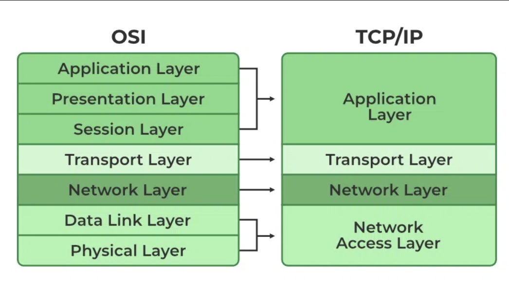

# 네트워크 모델

## OSI (Open Systems Interconnection) 모델

### 정의
- **국제표준화기구(ISO)**에서 1970년대 후반과 1980년대 초반에 개발
- 다양한 시스템과 기술 간의 상호 운용성을 촉진하기 위해 다양한 유형의 컴퓨터 네트워크에 대한 일반적인 표준
- OSI 모델은 네트워킹 시스템의 기능을 설명하는 이론적 프레임워크에 가까움.

### 7계층

------------------------------------

## TCP/IP (Internet protocol suite) 모델

### 정의
- Transmission Control Protocol/Internet Protocol
- 미국에서 개발됨 현대 인터넷의 전신인 ARPANET 창설의 일환으로 1970년대 국방부에 의해 만들어짐
- 인터넷과 대부분의 최신 네트워크를 통해 데이터가 전송되는 방식에 대한 기본 프레임워크
- 특히 인터넷 환경에서 실제로 널리 사용되는 프로토콜을 기반으로 하기 때문에 실제 애플리케이션에 더욱 실용적이다.

### 4계층

### 1. Network Access Layer (네트워크 엑세스 계층)
  - 데이터를 전달하는 전선, 케이블 또는 무선 신호(Wi-Fi)와 같은 장치 간의 물리적 연결을 다룬다.
  - 동일한 네트워크에 있는 한 장치에서 다른 장치로 데이터를 가져오는 일도 담당
  - 편지를 픽업하여 지역 우체국으로 배달하는 우편 서비스

#### 주요 프로토콜
  - [이더넷](./Protocol.md#이더넷-프로토콜), Wi-Fi, PPP, NIC(Network Interface Controller)

#### 프레임
  - 네트워크로 가기전 최종 캡슐화된 데이터
  - bit 단위
  - 프레임에는 전송되는 데이터와 오류 감지 코드 등 성공적인 전달에 필요한 추가 정보가 포함됨.
  - 네트워크 장치를 식별하는 역할

#### MAC 주소
[설명](./Protocol.md#이더넷-프레임-구조)

### 2. Internet Layer
  - 다양한 네트워크를 통해 발신자에서 수신자로 데이터를 라우팅하는 역할을 담당
  - 데이터(패킷이라고 하는 작은 조각으로 분할됨)가 네트워크를 통해 올바른 대상으로 가는 길을 찾도록 함.
  - 우체국이 편지를 분류하여 올바른 도시와 거리 주소로 라우팅하는 계층

#### 주요 프로토콜
- IP, ICMP, RP, RARP

#### 패킷
  - 데이터 페이로드와 소스 및 대상 IP 주소와 같은 추가 정보가 포함
  - 출발지 IP 주소, 목적지 IP 주소, 패킷 순서

#### IP 주소
- 대상 IP 주소를 기반으로 패킷을 전달

### 3. Transprot Layer
  - 장치 간에 데이터가 안정적이고 정확하게 전송되도록 하는 역할
  - 장치와 데이터를 보내는 장치 간의 통신을 관리하여 모든 패킷이 도착하고 올바르게 다시 결합될 수 있는지 확인
  - 편지가 분실되거나 손상되지 않았는지 확인하고 메시지의 모든 부분이 함께 도착하는지 확인하는 우편 서비스

#### 주요 프로토콜
- TCP, UDP

#### 데이터 단위
- **세그먼트** (segments) : TCP 일 때
- **데이터그램** (datagrams) : UDP 일 때

#### Port
- 운영체제는 네트워크 통신을 원하는 응용프로그램에게 포트번호를 할당함과 동시에 관리
- 포트 번호를 사용하여 데이터를 수신 장치의 올바른 애플리케이션으로 전달
- HTTP의 경우 포트 80을 사용하고 HTTPS의 경우 포트 443

### 4. Application Layer
  -  실제 데이터(예: 웹페이지, 이메일, 동영상)가 애플리케이션(예: 웹 브라우저 또는 이메일 클라이언트)에서 생성되고 사용되는 최상위 계층
  -  네트워크 서비스와 사용자 애플리케이션 간의 통신이 이루어지는 곳
  -  편지를 쓰고 도착하면 읽는 단계

#### 주요 프로토콜
- HTTP/HTTPS, FTP, SMTP, DNS, SSH

#### 데이터

### TCP/IP 네트워크 흐름
* 

1. Application Layer : 원본 서버(서버 A)의 애플리케이션이 대상 서버(서버 B)로 요청(예: HTTP 요청)을 보내면 프로세스가 시작
2. Transport Layer:  데이터는 TCP(또는 UDP) 세그먼트로 캡슐화됨. 
3. Internet Layer : 세그먼트는 패킷으로 캡슐화되고 IP 주소가 부여되며 네트워크를 통해 라우팅됨.
4. Networdk Access Layer : 패킷은 프레임으로 변환되어 물리적 네트워크 매체(예: 이더넷 또는 Wi-Fi)를 통해 전송됨.
5. 스위치 : 프레임을 보고 MAC주소를 기준으로 데이터 전송
6. 라우터 : 넘어온 프레임을 역캡슐화하여 패킷의 IP 주소를 보고 데이터 전송

#### 다른 서버로 요청을 보낼 때 

1. IP 주소 : 20.0.0.1을 목표로 데이터 전송
2. 인터넷 계층은 대상 IP 주소와 자신의 서브넷 마스크를 비교하여 대상 IP 주소(20.0.0.1)가 동일한 네트워크에 있는지 외부 네트워크에 있는지 확인
3. 인터넷 계층은 대상 IP 주소가 외부이고 패킷이 **기본 게이트웨이(라우터)**로 전송되어야 한다고 결정
4. 네트워크 액세스 레이어는 **ARP(주소 확인 프로토콜)** 를 사용하여 기본 게이트웨이(라우터)의 MAC 주소를 요청
5. ARP를 통해 라우터의 MAC 주소를 획득하면 링크 계층이 이더넷 프레임을 생성
6. 이더넷 프레임이 스위치로 전송
7. 스위치는 MAC 주소를 사용하여 이를 라우터로 전달
8. 라우터에서는 넘어온 프레임을 역캡슐화해서 패킷의 IP 도착지 정보를 봄.

### 요약 

| 계층        | 데이터 이름 | 장치 | 주요 정보 | 주요 프로토콜 | 
|-------------|-------------|------|-----------|---------------|
| Application | 데이터      |      | 요청 데이터 | HTTP |
| Transport   | 세그먼트    |      |  포트 번호 | TCP |
| Internet    | 패킷        | 라우터 | IP 주소 | IP |
| NewtWork Access | 프레임  | 스위치 | MAC 주소 | Ethernet |

Link Layer: 물리적 전송 및 MAC 주소 지정을 처리합니다.
Internet Layer: IP 주소 지정 및 라우팅을 관리합니다.
Transport Layer: TCP 및 UDP와 같은 프로토콜을 사용하여 안정적인 데이터 전송을 보장합니다.
Application Layer: 최종 사용자 애플리케이션에 네트워크 서비스를 제공합니다.

## 출처
https://en.wikipedia.org/wiki/Internet_protocol_suite
https://www.geeksforgeeks.org/tcp-ip-model/