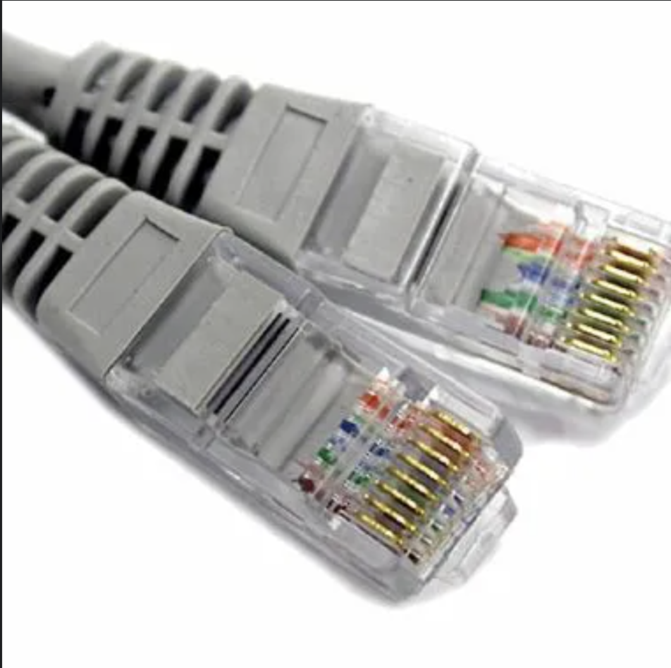

# Protocol

## 정의
- 컴퓨터가 서로 통신하기 위해 따르는 규칙 집합
- 데이터가 패키지되는 방식과 데이터의 각 부분에 포함된 정보를 포함한 데이터의 구조 또는 형식

## 구성 요소
- **구문(Syntax)**
  - 데이터의 구조나 형식 
  - 예를 들어, 프로토콜은 데이터를 헤더 및 페이로드와 같은 섹션으로 나눌 수 있다.
  - 헤더에는 보낸 사람의 주소와 같은 정보가, 페이로드에는 전송되는 실제 데이터가 포함되게 할 수 있다.
- **의미(Semantics)**
  - 데이터의 각 섹션의 의미 정의
  - 예를 들어, 헤더에는 데이터가 요청인지 응답인지 또는 전송되는 데이터의 종류(예: 텍스트 파일, 이미지 등)를 나타내는 플래그가 포함될 수 있다.
- **타이밍(Timing)**
  - 데이터가 전송 및 수신되는 순서와 전송 속도에 대한 규칙이 포함

## 특징
* 일관성
  * 장치가 다른 제조업체에서 제조되었거나 다른 소프트웨어를 사용하더라도 모든 장치가 수신되는 데이터를 이해할 수 있도록 보장
* 통신 규칙
  * 네트워크의 장치는 프로토콜을 사용하여 동일한 언어를 "말한다"
* 예시
  * HTTP/HTTPS, TCP, UDP, FTP, SMTP, IP

## 종류

### 이더넷 

- 건물이나 캠퍼스와 같은 제한된 영역 내에서 컴퓨터, 프린터, 라우터와 같은 장치를 연결하는 데 사용되는 네트워킹 기술 제품군
- 집, 사무실, 학교의 네트워크와 같은 근거리 통신망(LAN)의 장치를 연결하는 데 필수적
- OSI 2계층, 에 속한다.
- 구성 요소
  - 장치(노드)
    - 컴퓨터, 프린터, 스위치, 라우터와 같은 네트워크에 연결된 장치.
    - 각 장치에는 고유 식별자인 MAC 주소가 부여된다.
  - 케이블 및 커넥터
    - 연선 케이블 : Cat5e, Cat6 일반적으로 이더넷 연결에 사용
      - 
- 

### HTTP/HTTPS

### TCP

### UDP

### FTP

### SMTP 

### IP ()
- 인터넷 프로토콜
- IP주소를 이용하여 다른 LAN의 경로를 식별

템플릿 발송 일 경우 불필요