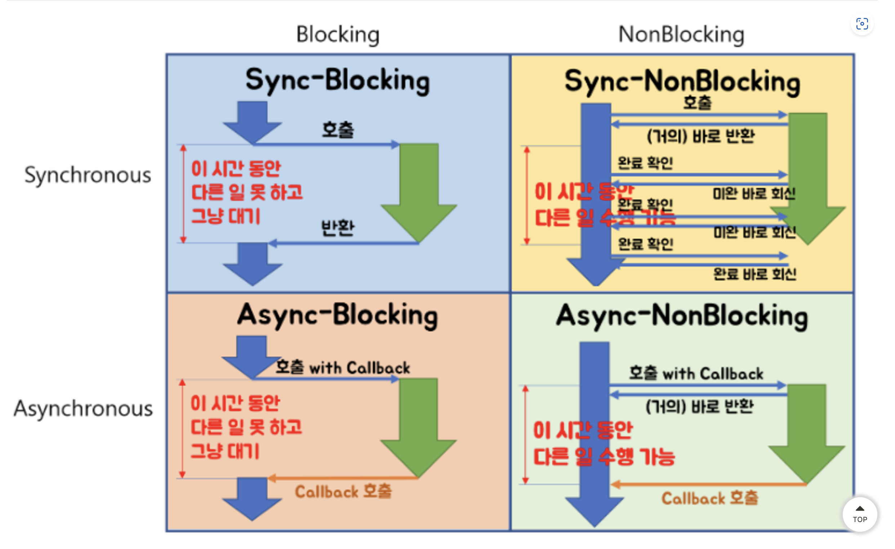

# 동기/비동기 & 블로킹&논블로킹

## 동기/비동기
### 동기(Synchronous) 
- 한 작업이 완료될 때까지 다음 작업이 시작되지 않는다. 기다린다.
  - 기다린다는 것이 반드시 실행 흐림이 멈추는 것은 아님.
- 요청과 응답이 순차적으로 이뤄짐
- 코드의 흐름을 이해하기 쉽고, 작업들이 예측가능한 순서로 실행됨

### 비동기(Asynchronous)
- 한 작업이 완료되기를 기다리지 않고, 다음 작업을 시작할 수 있음.
- 콜백, 프로미스, 이벤트를 사용하여 완료를 처리함.
- 작업들이 동시다발적으로 실행
- A 작업의 완료를 기다리는 동안 B 작업을 수행할 수 있어서, 리소스 활용도가 높다.
- 대신, 코드의 흐름이 복잡해지고 작업들의 완료 순서를 예측하기 어려움

## 예제코드 참고

## 블로킹/넌블로킹

### 블로킹 I/O 
- I/O 작업이 완료될 떄 까지 작업을 요청한 프로세스, 스레드는 대기 상태가 됨.
- 다른 작업을 수행할 수 없다.
- 리소스 활용도 낮음. 네트워크 지연이나 긴 파일 작업 시 프로그램의 반응성이 크게 떨어질 수 있음

### 넌블로킹 I/O 
- I/O 요청이 즉시 처리될 수 없을 때, 호출된 작업이 즉시 결과를 반환한다.
  - 그런데 결과가 최종 완료상태일 필요가 없다. 
- 프로세스나 스레드는 다른 작업을 계속 진행할 수 있음.
- I/O 작업 완료 여부를 주기적으로 확인하거나, 완료시 알림을 받는 방식으로 동작
- 리소스 활용도가 높다. 
- 프로그래밍이 복잡해질 수 있다.

## 예지 코드 참고 

## 결합 

### 동기-블로킹

### 동기-넌블로킹
- 동기는 한 작업 완료될 때 까지 다음 작업이 시작되지 않는데, 넌블로킹 I/O와 결합하면 완료가 아니더라도 즉시 답을 준다. 그래서 다음 작업이 수행가능. 
- 동작방식

### 비동기-블로킹

### 비동기-넌블로킹