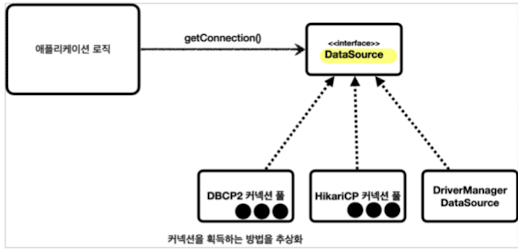

## DriverManager

~~~java
Connection connection = DriverManager.getConnection(URL, USERNAME, PASSWORD);
~~~

1. Drivermanager.getConnection()을 호출.
2. DriverManager가 스프링 라이브러리에 등록된 **DB Driver** 목록을 쭉 훑으면서 커넥션을 획득할 수 있는지 확인.
3. 여기서 Driver는 **JDBC 표준 인터페이스** 구현체들이다. 
4. 찾은 Driver를 반환.
   1. H2 : org.h2.jdbc.JdbcConnection
5. DB Driver 커넥션 획득 과정
   1. DB와 TCP/IP 커넥션 연결
   2. ID, PW 전달
   3. DB는 인증을 완료하고, 내부에 DB 세션 생성
   4. 커넥션 생성 완료 응답 보냄
   5. DB드라이버는 응답을 받아 커넥션 객체를 생성해서 클라이언트에 반환

## Connection Pool

DriverManager를 통해 매 요청마다 커넥션을 생성하는 것은 오래걸린다. 
그래서 미리 커넥션을 생성해두고 사용하자는 개념이 Connection Pool.

1. 어플리케이션 시작 시점에 미리 커넥션을 생성후, 풀에 보관. 기본값이 10개.
2. 이 커넥션들은 모두 DB와 TCP/IP로 연결되어 있는 상태.
3. 이제는 DB Driver를 사용하지 않고 커넥션 풀에서 가져다 쓰면 된다.
4. 커넥션 사용후, 종료가 아닌 반환을 하면 된다.

HikariCP를 스프링에서는 기본적으로 사용.

## DataSource 

javax.sql.DataSource
커넥션을 획득하는 방법을 추상화한 인터페이스
커넥션 조회 기능이 핵심.

HikariCP의 코드에 직접 의존하는 것이 아니라, DataSource 인터페이스에 의존하면 됨.

**DriverManagerDataSource**
DriverManager 기능을 가진 DataSource 인터페이스 구현체.
DataSource만 주입받으면 DriverManager도 이 클래스를 통해 구현할 수 있다.

**HikariDataSource**
HikariPool을 사용하는 datasource 구현체

### 자동 등록
스프링부트는 datasource를 자동등록해준다.
application.properties에 아래 처럼 정보를 미리 입력해주면,
~~~properties
spring.datasource.url=jdbc:h2:tcp://localhost/~/test
spring.datasource.username=sa
spring.datasource.password=
~~~

기본적으로 **HikariDataSource**를 빈으로 등록함.

## 트랜잭션
트랜잭션 ACID
1. 원자성 Atomicity
   1. 같은 트랜잭션 내에서 실행한 작업들은 모두 성공하거나 모두 실패하거나
2. 일관성 Consistency
   1. 일관성있는 데이터베이스 상태 유지
3. 격리성 Isolation
   1. 트랜잭션들이 서로에게 영향을 미치면 안된다.
   2. 4단계 
4. 지속성 Durability
   1.  성공적으로 끝내고 결과를 기록해야 한다.

### 트랜잭션은 어디서 시작해야 하나
비즈니스 로직이 있는 서비스 계층에서 시작해야 한다.
잘못된 비즈니스 로직을 함께 롤백해야 하기 때문.

결국, 서비스 계층에서 커넥션을 만들어야 하고 종료까지 해야 하는데, 이는 추후 AOP로 발전된다. 

## 세션 

DB와 커넥션이 생기면 DB는 내부에 세션을 만든다.
모든 요청은 이 세션을 통해 이뤄지는데 
세션이 트랜잭션을 만들고 커밋, 롤백해서 종료시키고 다시 만들 수 있다.

## DB 락
원자성을 지키기 위해.
같은 데이터를 세션1이 수정하는 동안, 세션2가 수정하지 못하도록 하는 설정.

세션1이 트랜잭션을 시작하면, 해당 row에 락을 획득한다.

세션2도 동일한 row에 수정을 하려하지만, 락이 없기 때문에 세션1이 트랜잭션을 끝내고 락을 반납할 때까지 기다려야 한다.

## PlatformTransactionManager

스프링 트랜잭션 인터페이스 (트랜잭션 매니저)
JDBC, JPA 마다 트랜잭션을 획득하는 코드가 다 다르다. 
이를 추상화하기 위해 스프링에서 만든 인터페이스.
각 데이터 접근 기술의 구현체를 의존성 주입하면 된다.

사용할 때는, 
DataSource의 구현체를 주입받아야 한다. 

즉, repository는 DataSource 구현체와 PlatformTransactionManager 구현체가 필요하다.

~~~java
DriverManagerDataSource dataSource = new DriverManagerDataSource(URL, USERNAME, PASSWORD);
PlatformTransactionManager transactionManager = new DataSourceTransactionManager(dataSource);
~~~

~~~java
//트랜잭션 시작
TransactionStatus status = transactionManager.getTransaction(new DefaultTransactionDefinition());

//커밋
transactionManager.commit(status);

//롤백
transactionManager.rollback(status);
~~~

### 자동등록
platformTransactionManager도 스프링이 자동등록을 해준다.

등록된 라이브러리를 보고 빈으로 등록하는데,
JDBC 라이브러리가 있으면, DataSourceTransactionManager.

JPA 라이브러리가 있으면, JpaTransactionManager. (jdbc기능도 가지고 있다.) 

## TransactionSynchronizationManager

트랜잭션 동기화 매니저.

ThreadLocal을 사용해서 커넥션을 동기화.
트랜잭션 매니저가 내부에서 동기화매니저를 호출한다.

동작방식
트랜잭션 매니저가 커넥션을 시작하면, 트랜잭션 동기화 매니저에 보관한다. 
리포지토리가 동기화 매니저에 보관된 커넥션을 사용한다.

커넥션 호출
~~~java
DataSourceUtils.getConnection()
~~~
위 메서드 내부에서 transactionsynchronizationmanager를 사용
동기화 매니저 내부에 있는 커넥션을 꺼내옴. 없으면 새로 만듦.

커넥션 반환
~~~java
DataSourceUtils.releaseConnection()
~~~
커넥션을 종료시키는 것이 아니라, 동기화 매니저에 돌려줌.

## TransactionTemplate
비즈니스 로직에서 반복되는 try cath commit rollback을 템플릿 콜백 패턴으로 만들어주는 템플릿 클래스

~~~java
this.txTemplate = new TransactionTemplate(transactionManager);
~~~
transactiontemplate은 주입받은 PlatformTransactionManager를 가지고 만든다.

## @Transactional
스프링AOP를 통해 프록시 도입.
서비스 계층에 여전히 남아있는 트랜잭션 코드를 없애기 위해.

@Transactional을 쓰더라도 내부에서 
DataSource, PlatformTransactionalManager 모두 빈 등록이 필요하다.