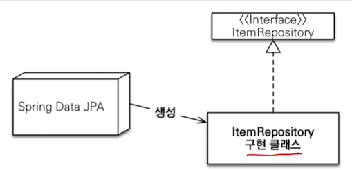

# JPA
https://docs.jboss.org/hibernate/orm/6.2/userguide/html_single/Hibernate_User_Guide.html#pc-persist

## dependency
~~~gradle
implementation 'org.springframework.boot:spring-boot-starter-data-jpa'
~~~

참고로 jdbc의존성도 포함하고 있다. 

## properties
~~~properties
logging.level.org.hibernate.SQL=debug
//하이버네이트 SQL 확인.
logging.level.org.hibernate.type.descriptor.sql.BasicBinder=trace ---> logging.level.org.hibernate.orm.jdbc.bind=TRACE
// SQL에 바인딩되는 파라미터 확인
// 스프링부트 3.0에서 오른쪽으로 바뀜.
~~~

```properties
spring.jpa.show-sql=true
```
- system.out으로 출력돼서 권장하지 않음.

## 의의
Entity Relationship을 Object Relationship으로 바꿔주는것.

1. JPA는 자바진영 ORM 표준 인터페이스
2. 이를 구현한 것이 Hibernate
3. 객체를 관계형DB 테이블과 매핑해줌.
4. 자바 컬렉션에 저장하고 조회하듯이 사용가능
5. SQL 대신 만들어줌.

## 주의
원래 목적은 insert update delete가 목적

쿼리(조회)에는 매우 불리하다.


## @Entity
JPA가 사용하는 객체라고 지정
엔티티라고 부른다.


## JPQL
객체를 대상으로 하는 SQL

## 스프링 데이터 JPA
JPA를 편리하게
JPARepository 인터페이스 제공. 기본적인 CRUD 가능.



JPARepository를 상속받은 인터페이스를 프록시로 구현체를 만듦. 

https://docs.spring.io/spring-data/jpa/docs/current/reference/html/#jpa.query-methods.query-creation

https://docs.spring.io/spring-data/jpa/docs/current/reference/html/#repositories.limit-query-result

### @Query
JPARepository를 상속받은 상태에서 JPQL을 사용하려면 @Query와 함께 사용.

### @Repository 필요하나?
Spring data JPA는 @Repository 없어도 예외 변화해준다. 