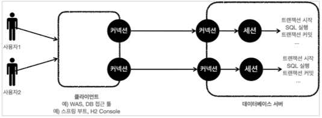

# 트랜잭션

## 개념
서버가 DB와 커넥션 연결 -> DB 세션생성 -> 세션 트랜잭션 생성 -> SQL 구문 실행 -> 트랜잭션 종료

트랜잭션 ACID
1. 원자성 Atomicity
   1. 같은 트랜잭션 내에서 실행한 작업들은 모두 성공하거나 모두 실패하거나
2. 일관성 Consistency
   1. 일관성있는 데이터베이스 상태 유지
3. 격리성 Isolation
   1. 트랜잭션들이 서로에게 영향을 미치면 안된다.
   2. 4단계 
4. 지속성 Durability
   1.  성공적으로 끝내고 결과를 기록해야 한다.

### 트랜잭션은 어디서 시작해야 하나
비즈니스 로직이 있는 서비스 계층에서 시작해야 한다.
잘못된 비즈니스 로직을 함께 롤백해야 하기 때문.

결국, 서비스 계층에서 커넥션을 만들어야 하고 종료까지 해야 하는데, 이는 추후 AOP로 발전된다. 

## 세션 

DB와 커넥션이 생기면 DB는 내부에 세션을 만든다.
모든 요청은 이 세션을 통해 이뤄지는데 
세션이 트랜잭션을 만들고 커밋, 롤백해서 종료시키고 다시 만들 수 있다.

## DB 락
원자성을 지키기 위해.
같은 데이터를 세션1이 수정하는 동안, 세션2가 수정하지 못하도록 하는 설정.

세션1이 트랜잭션을 시작하면, 해당 row에 락을 획득한다.

세션2도 동일한 row에 수정을 하려하지만, 락이 없기 때문에 세션1이 트랜잭션을 끝내고 락을 반납할 때까지 기다려야 한다.

## PlatformTransactionManager
트랜잭션 매니저.

각 DB 기술마다 서로 다른 트랜잭션 연결 코드를 추상화한 인터페이스.

DB기술에 맞게 구현체가 있다. 
ex) JpaTransactionManager.

## 관련 method

~~~java
AopUtils.isAopProxy(Object object)
~~~
Check whether the given object is a JDK dynamic proxy or a CGLIB proxy.
boolean 반환.

~~~java
TransactionSynchronizationManager.isActualTransactionActive();
~~~
현재 쓰레드에 트랜잭션이 적용되어 있는지 확인하는 메서드.

~~~java
TransactionSynchronizationManager.isCurrentTransactionReadOnly()
~~~
현재 트랜잭션이 readOnly인지 아닌지 boolean 반환.

## 기억해야될 점.
1. @Transactional을 구체적인 곳에 붙을 수록 우선순위를 가진다. 
   1. 클래스 method
   2. 클래스
   3. 인터페이스 method
   4. 인터페이스

2. 클래스에 @Transactional이 붙으면 method에도 자동 적용된다.
3. 프록시 내부 호출 
   1. @Transactional 이 안붙은 메서드를 호출하고 그 내부에서 @Transactional이 붙은 같은 클래스의 메서드를 호출하면, 프록시가 생성되지 않는다. 