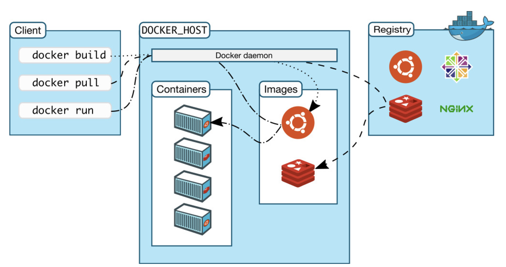

# Docker 

## Docker란?

컨테이너 기반의 오픈소스 가상화 플랫폼.

컨테이너를 관리하는 플랫폼

다양한 이유로 바뀌는 서버, 개발 환경 문제를 해결하기 위해 등장

기존에는 환경이 변경되면 세팅을다시 해야했는데 도커가 등장하면서 편리함 도입

## 구성요소

- clinet 
  - 사용자가 Docker와 상호작용할 수 있도록 해주는 명령줄 인터페이스(CLI)
- docker host
  - Docker Daemon과 실행 중인 컨테이너가 배포되는 실제 서버
  - Docker Daemon이 실행되는 물리적 또는 가상 머신
  - 컨테이너를 위한 리소스를 제공하며, Docker Client는 이 호스트에 연결하여 명령을 실행
- docker daemon (dockerd)
  - 도커 엔진
  - Docker 시스템의 핵심이며, Docker의 백엔드에서 작업을 실행
  - 컨테이너를 만들고, 시작하고, 중지하고, 삭제하는 등 모든 작업을 처리
  - Docker 이미지, 컨테이너, 네트워크 및 볼륨 등의 리소스를 관리
- docker images
  - build 하거나 Registry에서 pull 하거나
- docker registry
  - Docker 이미지를 저장하고 배포하는 저장소
- docker container
  - Docker 이미지를 실행한 인스턴스
- Docker Volumes
  - 컨테이너가 데이터를 저장하는 데 사용되는 디스크 공간
  - 컨테이너의 파일 시스템 외부에 저장되며, 컨테이너가 종료되더라도 데이터를 유지
- Docker Networks
  - 서로 다른 컨테이너 간에 통신을 할 수 있게 하는 가상 네트워크

## 도커 이미지
- 이미지와 컨테이너는 1:N 관계
- 컨테이너를 생성할 때 필요한 요소
- 여러 계층으로 된 바이너리 파일

### 도커 이미지 이름
저장소 이름/이미지 이름/이미지 태그
repository/nginx:1.22

## 도커 컨테이너

- 호스트와 다른 컨테이너로부터 격리된 공간에서 프로세스가 동작하는 기술
- 이미지는 읽기 전용이기 때문에 이미지에 변경이 생기지는 않음.

다양한 프로그램, 실행환경을 컨테이너로 추상화하고 동일한 인터페이스를 제공하여 프로그램의 배포 및 관리를 단순하게 해줌.

이러한 컨테이너를 로컬pc, aws, azure, google cloud 어디에서든 실행할 수 있음

기존의 가상머신은 OS를 가상화 시켰음. 컴퓨터의 물리적 자원을 분할하기 때문에 성능의 한계가 있었음

도커는 OS단까지 내려가지 않고 실행환경만 독립적으로 돌림. 훨씬 빠르고 가벼움.

container는 호스트 운영체제 입장에서 process와 거의 동일.

### 컨테이너 격리 기술 

컨테이너가 서로 독립적으로 실행될 수 있도록 하는 핵심 기능

리눅스의 커널 기능을 활용하여 애플리케이션을 격리된 환경에서 실행시키는 방식으로, 여러 애플리케이션이 동일한 호스트 시스템에서 실행되더라도 서로 영향을 미치지 않도록 한다.

#### 네임스페이스 (Namespaces)

네임스페이스는 **커널 기능**으로, **프로세스들이 자신만의 독립된 환경을 갖도록 해주는 역할**을 합니다. Docker는 여러 종류의 네임스페이스를 사용하여 컨테이너 간의 격리를 구현합니다.
-	**PID 네임스페이스 (PID Namespace):**
    -	각 컨테이너는 **독립적인 프로세스 ID(PID) 네임스페이스**를 가지고 있습니다. 이로 인해 컨테이너 내에서 실행되는 프로세스들은 호스트 시스템이나 다른 컨테이너의 프로세스와 충돌하지 않습니다.
    -	예를 들어, 컨테이너 A는 프로세스 ID 1번에서 시작된 프로세스를 볼 수 있지만, 이는 컨테이너 A 내부에서만 유효하며, 호스트나 다른 컨테이너에는 영향을 주지 않습니다.
-	**네트워크 네임스페이스 (Network Namespace):**
    -	Docker는 각 컨테이너마다 **고유한 네트워크 네임스페이스**를 제공합니다. 이는 각 컨테이너가 독립적인 네트워크 스택(IP 주소, 포트 번호, 라우팅 등)을 갖게 함으로써 격리를 실현합니다.
    -	각 컨테이너는 기본적으로 외부 네트워크와 연결되지 않으며, 필요한 경우 bridge, host, overlay 등의 네트워크 모드를 사용하여 외부와 통신할 수 있습니다.
-	**파일시스템 네임스페이스 (Mount Namespace):**
    -	Docker는 각 컨테이너가 **독립적인 파일 시스템**을 갖도록 격리합니다. 컨테이너는 읽기 전용 또는 읽기/쓰기 파일 시스템을 사용할 수 있으며, 이를 통해 호스트 시스템의 파일 시스템과 격리됩니다.
    -	Docker는 UnionFS(유니온 파일 시스템)을 사용하여 여러 파일 시스템 계층을 결합하여 이미지를 구성합니다. 각 컨테이너는 이 이미지를 기반으로 독립적인 파일 시스템을 사용합니다.
-	**UTS 네임스페이스 (UTS Namespace):**
    -	UTS는 “Unix Timesharing System”의 약자이며, 호스트 시스템의 호스트네임과 도메인네임을 컨테이너마다 별도로 설정할 수 있게 해줍니다.
    -	이로 인해 각 컨테이너는 **독립적인 호스트 이름**을 가질 수 있어, 컨테이너들이 동일한 네트워크 내에서 실행되더라도 서로를 구분할 수 있습니다.
-	**IPC 네임스페이스 (IPC Namespace):**
    -	IPC는 “Inter-Process Communication”을 의미합니다. 컨테이너는 서로 **독립적인 메모리, 세마포어, 공유 메모리** 등을 사용하며, 다른 컨테이너와의 통신을 방지합니다.
    -	이를 통해 서로 다른 컨테이너에서 실행되는 프로세스들이 자원 충돌 없이 실행될 수 있습니다.

#### 컨트롤 그룹 (Cgroups)

**Cgroups(Control Groups)** 는 리눅스 커널 기능으로, 각 프로세스나 그룹의 자원 사용을 제한하고, 할당된 자원(메모리, CPU, 디스크 I/O 등)을 관리하는 역할을 합니다. Docker는 Cgroups를 활용하여 컨테이너별로 리소스를 제한하거나 보장할 수 있습니다.
-	리소스 제한: Docker는 **Cgroups를 통해** 각 컨테이너가 사용하는 CPU, 메모리, I/O 등의 **리소스를 제한**할 수 있습니다. 예를 들어, 한 컨테이너가 너무 많은 CPU를 사용하는 것을 방지하거나, 메모리 과다 사용으로 다른 컨테이너나 호스트 시스템에 영향을 미치지 않도록 할 수 있습니다.
-	리소스 보장: **특정 컨테이너에 리소스를 보장**할 수 있습니다. 예를 들어, 중요한 애플리케이션이 실행되는 컨테이너가 항상 일정량 이상의 CPU나 메모리를 사용할 수 있도록 보장할 수 있습니다.

#### Linux Capabilities

Linux Capabilities는 리눅스 커널에서 제공하는 **보안 기능**으로, 프로세스에 대해 권한을 세분화하여 부여할 수 있습니다. Docker는 기본적으로 컨테이너에서 실행되는 프로세스가 호스트 시스템의 민감한 자원에 접근할 수 없도록 제한합니다. **컨테이너는 필요하지 않은 권한을 갖지 않으며**, 특정 시스템 호출에 대한 액세스만 허용합니다.
-	예를 들어, 컨테이너는 기본적으로 루트 권한을 갖지 않으며, 네트워크, 파일 시스템, 커널 모듈 등 중요한 시스템 자원에 접근할 수 없습니다.

#### Seccomp (Security Computing Mode)

Seccomp는 커널 기능으로, 프로세스가 호출할 수 있는 시스템 호출을 제한하여 보안을 강화합니다. Docker는 이를 통해 **컨테이너에서 불필요하거나 위험한 시스템 호출을 차단**하여, 잠재적인 보안 취약점을 방지합니다.
-	예를 들어, 컨테이너 내의 프로세스는 ptrace 시스템 호출(디버깅 도구 관련)을 사용하지 못하도록 할 수 있습니다.

#### AppArmor / SELinux (Security Modules)

AppArmor와 SELinux는 리눅스 시스템의 보안 모듈로, 컨테이너가 호스트 시스템에서 실행되는 동안 **사용할 수 있는 자원과 접근할 수 있는 영역을 세밀하게 정의하고 제한**합니다. Docker는 이러한 보안 모듈을 사용하여, 컨테이너의 권한을 제한하고, 잠재적인 공격을 방어하는 역할을 합니다.
-	AppArmor: 컨테이너의 행동을 프로파일로 정의하고, 이를 통해 허용된 동작만 수행하게 합니다.
-	SELinux: 보안 정책을 통해 파일, 프로세스, 네트워크에 대한 접근을 제어합니다.

## 출처 

https://subicura.com/2017/01/19/docker-guide-for-beginners-1.html
https://www.youtube.com/watch?v=chnCcGCTyBg