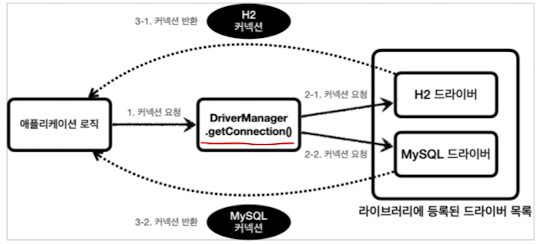

# Jdbc 관련 클래스

## DriverManager



```java
@Slf4j
public class DBConnectionUtil {
    public static Connection getConnection() {
        try {
            Connection connection = DriverManager.getConnection(URL, USERNAME, PASSWORD);
            log.info("get connection={}, class={}", connection, connection.getClass());
            return connection;
        } catch (SQLException e) {
            throw new IllegalStateException(e);
        }
    }
}
```

- 라이브러리에 등록된 DB 드라이버들을 자동으로 인식하고 관리한다.
- Drivermanager.getConnection()을 호출하면 이 드라이버들에게 커넥션을 획득할 수 있는지 확인
  - ex) H2 : org.h2.jdbc.JdbcConnection 커넥션 반환
- DB 커넥션 획득 과정
  - 애플리케이션이 DB driver에 커넥션 요청
  - 각 드라이버는 URL, ID, PW 정보를 가지고 본인이 처리할 수 있는 요청인지 확인
  - 처리가능하면 드라이버는 DB와 TCP/IP 커넥션 연결
  - ID, PW 전달
  - DB는 인증을 완료하고, 내부에 DB 세션 생성
  - 커넥션 생성 완료 응답 보냄
  - DB드라이버는 응답을 받아 **Connection 구현체**를 생성해서 클라이언트(애플리케이션)에 반환

--------------------------------------------------------------------------------------------------------------------------------------------------------------------------------------------------------------------------------

## insert / update / delete

```java
public Member save(Member member) throws SQLException {
   String sql = "insert into member(member_id, money) values(?,?)";

   Connection connection = null;
   PreparedStatement pstmt = null;

   try{
      connection = DBConnectionUtil.getConnection();
      pstmt = connection.prepareStatement(sql);
      pstmt.setString(1, member.getMemberId());
      pstmt.setInt(2, member.getMoney());
      pstmt.executeUpdate();
      return member;
   }catch (SQLException e) {
         log.error("db error", e);
      throw e;
   }finally {
      close(connection, pstmt, null);
   }

   if (connection != null) {
      try {
            connection.close();
      } catch (SQLException e) {
            log.error("error", e);
      }
   }

   private void close(Connection connection, Statement stmt, ResultSet resultSet) {

      JdbcUtils.closeResultSet(resultSet);
      JdbcUtils.closeStatement(stmt);
      JdbcUtils.closeConnection(connection);
   }
}
```
- 기본적인 구성은 위와 같다.
- DriverManager.getConnection()를 사용해서 Connection 구현체를 가져온다.
- PreparedStatement psmt = connection.prepareStatement(sql)을 생성한다.
  - Statement의 자식타입.
  - ?를 통해 sql 쿼리에 바인딩을 가능하게 해준다.
  - SQL injection 공격 예방을 위해서는 사용해야함
- PreparedStatement에 바인딩을 하여 쿼리를 완성한다.
  - pstmt.setString(1, member.getMemberId());
    - set을 통해 지정한 순서의 ?에 파라미터를 바인딩해준다.
- 완성된 SQL을 DB에 전달
  - pstmt.executeUpdate();
  - 영향받은 DB row수를 int로 반환한다.
- 리소스 정리 
  - 역순으로 ResultSet, PreparedStatement, Connection을 닫아준다.
  - **JdbcUtils**의 함수를 사용해서 닫아주면 편하다.

## select 

```java
   log.info("memberId == {}", memberId);
   String sql = "select * from member where member_id = ?";

   Connection con = null;
   PreparedStatement pstmt = null;
   ResultSet rs = null;

   try {
      con = getConnection();
      pstmt = con.prepareStatement(sql);
      pstmt.setString(1, memberId);

      rs = pstmt.executeQuery();
      if (rs.next()) {
            Member member = new Member();
            member.setMemberId(rs.getString("member_id"));
            member.setMoney(rs.getInt("money"));
            return member;
      } else {
            throw new NoSuchElementException("member not found memberId=" + memberId);
      }
   } catch (SQLException e) {
      log.error("error", e);
      throw e;
   }finally {
      close(con, pstmt, rs);
   }
```
- select 쿼리의 다른점은 
- ResultSet rs =  pstmt.**executeQuery();**
  - 조회한 결과를 **ResultSet**에 담아서 반환한다.
- rs.next()를 커서를 다음으로 옮기면서 응답을 객체로 바인딩한다.

--------------------------------------------------------------------------------------------------------------------------------------------------------------------------------------------------------------------------------

## Connection Pool


- [drivermanager](#drivermanager) Connection을 맺는 일련의 과정을 매번 하기에는 시간과 리소스가 소요된다.
- 그래서 미리 Connection을 생성해두고 사용하자는 개념이 Connection Pool.

- 어플리케이션 시작 시점에 미리 Connection을 생성후, Connection Pool에 보관해둔다. 
  - 보통 기본값이 10개.
- 생성된 Connection들은 모두 DB와 TCP/IP로 연결되어 있는 상태이기에 즉시 사용가능하다.
- 이제는 애플리케이션에서 DB Driver에 Connection을 요청하는 것이 아니라 Connection Pool에서 가져다 쓰면 된다.
- Connection 사용후, 종료가 아닌 반환을 하는 것을 변경
- **HikariCP**를 스프링부트에서는 기본적으로 사용.

--------------------------------------------------------------------------------------------------------------------------------------------------------------------------------------------------------------------------------

## DataSource 


- javax.sql.DataSource
- 커넥션을 획득하는 방법을 추상화한 인터페이스

### 사용 이유
- Connection을 얻는 방법에는 DriverManager를 통하거나, Connection Pool에서 가져오기 등등 여러 방법이 있다.
- 문제는 기존에 쓰던 방식에서 다른 방식으로 변경하려면 코드를 수정해야된다.
- 따라서, 방법을 변경해도 코드에는 변경이 일어나지 않도록 **DataSource** 라는 interface를 제공하게 되었다.

### 기능
- 커넥션 조회 기능

```java
DriverManagerDataSource dataSource = new DriverManagerDataSource(URL, USERNAME, PASSWORD);
HikariDataSource dataSource = new HikariDataSource();

dataSource.getConnection();
```

### 구현 클래스
**DriverManagerDataSource**
DriverManager 기능을 가진 DataSource 인터페이스 구현체.
DataSource만 주입받으면 DriverManager도 이 클래스를 통해 구현할 수 있다.

**HikariDataSource**
HikariPool을 사용하는 datasource 구현체

### 자동 등록
~~~properties
spring.datasource.url=jdbc:h2:tcp://localhost/~/test
spring.datasource.username=sa
spring.datasource.password=
~~~
- 스프링부트는 application.properties에 아래 처럼 정보를 미리 입력해주면 datasource를 Bean으로 등록해준다.
- 기본적으로 **HikariDataSource**를 빈으로 등록함.