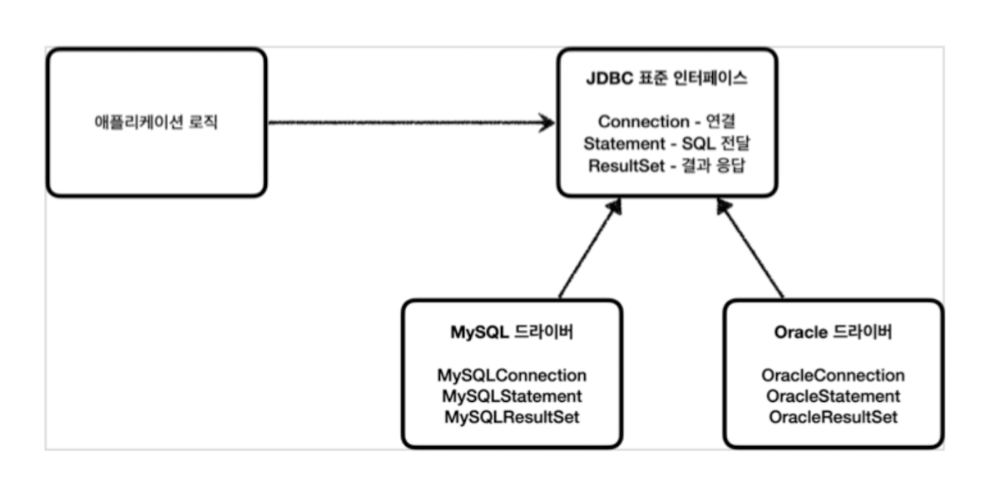

#JDBC 기본

## 서버와 DB의 일반적인 사용법
1. 커넥션 연결
   1. 주로 TCP/IP를 사용해서 서버에서 DB로 커넥션을 연결.
2. SQL 전달
   1. 서버는 DB의 언어인 SQL을 커넥션을 통해 DB에 전달
3. 결과 응답
   1. 전달받은 SQL을 수행한 DB는 해당 결과를 서버에 응답

## 탄생 배경 
문제는 위와같은 일련의 과정이 각 데이터베이스 종류 마다 달랐다.
그러면 DB를 변경할 때마다, 코드를 다 바꿔줘야 하는 불편함이 있었다.
그래서 통일을 해주기 위해 JDBC 자바 표준이 등장

## JDBC 표준 인터페이스
- Java Database Connectivity
- 자바에서 데이터베이스에 접속할 수 있도록 하는 자바 API
- 표준 커넥션 인터페이스를 정의한다.

- 대표적인 3가지 기능을 interface로 제공한다.
  - java.sql.Connection : 연결
  - java.sql.Statement  : SQL을 담은 내용
  - java.sql.ResultSet  : SQL 요청 응답

- JDBC 드라이버
  - 위의 interface들을 각 DB 벤더사에서 구현한 라이브러리

## 동작 방식

JDBC 표준 인터페이스가 있고 

이를 각 DB 벤더에서 구현한 드라이버가 대신해서 DB와 동작을 수행한다.

## 한계점
- 일부 SQL, 데이터타입 등 모든 DB 벤더사가 통일도니것은 아니다. 
  - ANSI SQL이라는 표준이 있기는 하지만 일반적인 부분만 공통화됨.
- 결국 일부분은 DB를 변경하면 SQL은 변경할 필요가 있다.
- JPA(Java Persistence API)를 사용하면 어느정도 해결가능.

## 발전 방향
오래된 JDBC는 복잡하다. 그래서 편리한 방향을 발전이 되었는데...

1. SQL Mapper
   1. **서버** -----SQL 전달-------> **SQL Mapper** -----SQL 전달-------> **JDBC**
   2. 종류 : JdbcTemplate, MyBatis
   3. SQL응답 결과를 자바 객체로 변환해줌.
   4. 반복코드 제거
   5. 단점은 개발자가 직접 SQL을 작성해야한다.

2. ORM

   1. 자바의 객체를 관계형 DB 테이블과 매핑해주는 기술
   2. ORM 기술이 개발자 대신 SQL을 동적으로 만들어 샐행해줌.
   3. 대표적으로 JPA가 있다.
      1. JPA는 자바진영 ORM 표준 인터페이스
      2. 이를 구현한 것이 Hibernate
   4. 자바 컬렉션에 저장하고 조회하듯이 사용가능

마치 JDBC를 쓰지 않는 것 처럼 보이지만, 사실 마지막에는 JDBC로 SQL을 전달해서 DB와 동작한다.
중간에 SQL Mapper혹은 ORM을 사용하는 것. 

결국 JDBC부터 알아야 한다. 기본이기 때문에.

## 출처

https://www.baeldung.com/java-jdbc

김영한 스프링DB 강의