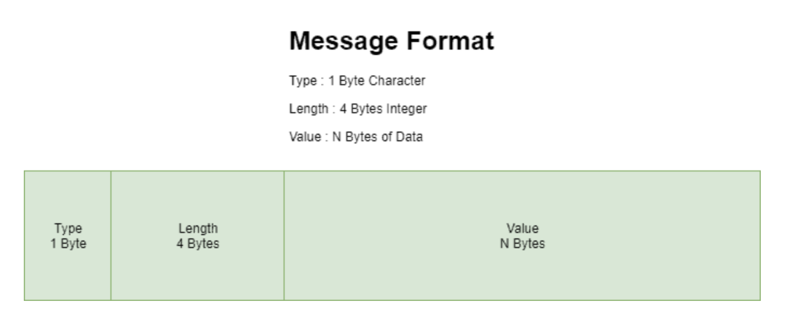

# Java Socket

## socket programming
- 네트워크를 통해 서로 연결된 여러 대의 컴퓨터에서 실행되는 프로그램을 작성
- 소켓 프로그래밍에서 사용할 수 있는 통신 프로토콜에는 2가지가 있음
  - Transfer Control Protocao (TCP)
    - 서버와 클라 사이에 독점적인 연결이 설정되어야하는 통신
  - User Datagram Protoco (UDP)
    - 서버와 클라 사이에 세션이 없는 통신
-  서버 간의 낮은 수준의 통신 세부 사항을 처리하는 클래스 및 인터페이스 모음을 제공
   -  대부분 java.net 패키지에 존재

## ServerSocket
- 서버 측에서 클라이언트의 연결 요청을 기다리는 역할
- 특정 포트에서 들어오는 요청을 듣고, 클라리언트 연결이 들어오면 이를 수락.
- 수락 후, 클라이언트와 통신할 수 있는 Socket 객체를 생성.

```java
ServerSocket serverSocket = new ServerSocket(port)
```
- `ServerSocket` 객체 생성
- 지정된 port에 바인딩.

```java
Socket clientSocket = serverSocket.accept()
```
- 클라이언트의 연결 요청을 기다리다가, 요청이 들어오면 요청을 수락하고 클라이언트와 통신하기 위한 `Socket` 객체를 반환
- accept 코드를 만나면 클라이언트가 연결 요청을 할 때까지 block 된다.


```java
    public Socket accept() throws IOException {
        if (isClosed())
            throw new SocketException("Socket is closed");
        if (!isBound())
            throw new SocketException("Socket is not bound yet");
        Socket s = new Socket((SocketImpl) null);
        implAccept(s);
        return s;
    }
```
- 내부 코드를 살펴보면, socket이 닫히거나 바운드되지 않으면 예외를 발생시킨다.


```java
serverSocket.close()
```
- 서버 소켓을 닫고, 해당 서버 소켓이 사용하던 모든 시스템 리소스를 해제
- ServerSocket 객체를 더 이상 사용할 수 없게된다.

```java
serverSocket.setSoTimeout(int timeout)
```
- accept()가 영원히 블로킹 상태에 머물지 않도록 하여, 지정된 시간 동안만 연결 요청을 기다리도록 설정


## Socket


### 개념
-  자바에서 네트워크 통신을 위해 사용되는 핵심 클래스
-  네트워크를 통해 데이터를 송수신하기 위한 endpoint을 추상화한 것
-  클라이언트는 `Socket` 객체를 사용하여 서버에 연결하고, 서버는 `ServerSocket`을 사용하여 클라이언트의 연결 요청을 수락
-  연결이 성립되면, 서버와 클라이언트는 각각의 `Socket` 객체를 통해 데이터를 주고받는다.
  
### 특징
- 점대점 통신: TCP/IP 네트워크에서 두 노드 간의 점대점(point-to-point) 연결을 설정
- 신뢰성 있는 데이터 전송: TCP 기반으로 동작하기 때문에, 데이터 전송 순서가 보장되며, 손실되거나 손상된 데이터 없이 전송
- 방향 통신: 데이터를 양방향으로 전송할 수 있어, 서버와 클라이언트는 서로에게 데이터를 보내고 받을 수 있음

### 주요 함수
  
```java
Socket socket = new Socket(serverAddress, port)
```
- Socket 객체 생성
- 클라이언트는 서버의 host와 port가 필요
- 전송 계층이 데이터를 전송할 애플리케이션을 식별할 수 있도록 포트 번호에 바인딩 됨.

```java
try (Socket socket = new Socket()) {
    // 소켓 연결에 타임아웃을 5000 밀리초(5초)로 설정
    socket.connect(endpoint, 5000);
}
```
- 소켓을 서버에 연결. 
- 이미 연결된 소켓에 대해서는 예외를 던진다.
- Socket 객체를 생성할 때 바로 연결하지 않고, 나중에 명시적으로 연결을 시작하고자 할 때 유용
- 연결 시도에 타임아웃 설정이 가능하다.

```java
OutputStream outputStream = socket.getOutputStream();
outputStream.write("HELLO".getBytes());

PrintWriter out = new PrintWriter(socket.getOutputStream(), true);
out.println("hello");

DataOutputStream out = new DataOutputStream(socket.getOutputStream());
out.writeChar(type);
out.writeInt(data.length());
out.write(dataInBytes);
```
- 소켓으로 데이터를 쓰기 위한 PrintWriter를 반환

### 소켓에서 데이터를 읽는 법

```java
InputStream in = clientSocket.getInputStream();
int read = in.read();

BufferedReader input = new BufferedReader(new InputStreamReader(socket.getInputStream()));
String serverResponse = input.readLine(); // 서버로부터 한 줄의 메시지를 읽습니다.

DataInputStream in = new DataInputStream(new BufferedInputStream(socket.getInputStream()));

```
- 소켓으로부터 데이터를 읽기 위한 InputStream을 반환
- 통신의 연속성을 허용하려면 while 루프 내에서 입력 스트림을 읽고 클라이언트가 종료 요청을 보낼 때만 종료
- readChar(), readInt(), readDouble()를 사용해서 데이터를 수신할 수 있음.
  - 데이터의 유형과 길이를 미리 모르면 사용하기 어려움.
  - 그래서 read()를 사용해서 소켓에서 바이트 스트림을 가져온다.

### 소켓에서 바이너리 데이터 읽기
- 데이터를 바이트 단위로 읽을 때는 서버와 클라이언트 간의 통신을 위한 자체 프로토콜을 정의해야 한다.
- 가장 간단하게 프로토콜을 TLV(Type Length Value)로 정의할 수 있다.
- 소켓에 기록되는 모든 메시지가 타입, 길이, 값의 형태로 되어 있음을 의미.



- Type : 데이터의 유형을 나타내는 1바이트의 문자 
- Length : 데이터의 길이를 나타내는 4바이트의 정수
- Value : 실제 데이터

```java
DataInputStream dataInputStream = new DataInputStream(new BufferedInputStream(socket.getInputStream()));
int length = dataInputStream.readInt();
byte[] messageByte = new byte[length];
boolean end = false;
StringBuilder dataString = new StringBuilder(length);
int totalBytesRead = 0;
int currentBytesRead = dataInputStream.read(messageByte);
```
-  입력 스트림(`dataInputStream`)으로부터 바이트 데이터를 읽어서 바이트 배열 `messageByte에` 저장
   -  messageByte.length 만큼의 바이트를 읽음
-  반환하는 int 값은 실제로 읽혀진 바이트 수
   -  만약 입력 스트림의 끝에 도달해서 더 이상 읽을 데이터가 없다면 -1 반환
      -  데이터의 끝은 -1로 잘 판단해야 함.
   -  읽혀진 바이트 수를 사용하지않고 배열의 길이만으로 데이터를 처리하려 하면, 데이터가 부족하거나, 배열에 남은 이전 데이터로 인해 오류가 발생할 수 있음
-  데이터가 도착할 때까지 이 메소드는 호출된 스레드를 블로킹(일시 정지) 상태로 만든다.

## 출처
https://www.baeldung.com/a-guide-to-java-sockets