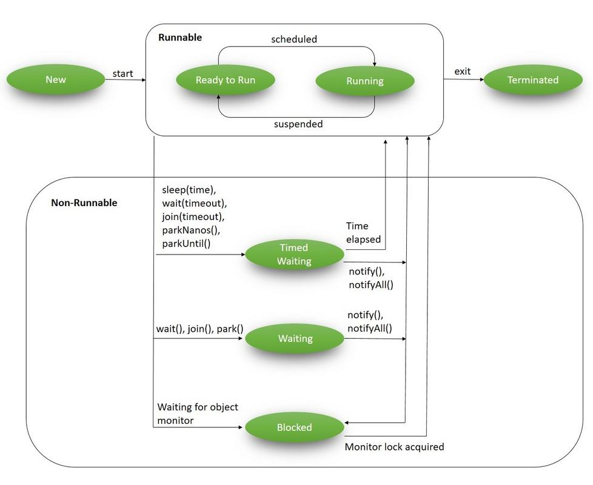

# 쓰레드 스케쥴링

## Life Cycle of a Thread

[공식문서](https://docs.oracle.com/en/java/javase/17/docs/api/java.base/java/lang/Thread.State.html#WAITING)



Thread Class는 Enum으로 State를 가지고 있다.

```java
Thread.getState()
```

로 확인가능.

### NEW

아직 start()가 호출되지 않은 새로 생성된 스레드

### RUNNABLE

`Running`(실행중)이거나 `Ready to Run`(실행 준비중)인 상태.

`start()`를 호출하면 상태가 **RUNNABLE**로 변경된다.

시스템에서 리소스 할당을 기다리고 있다.

멀티쓰레드 환경에서 쓰레드스케쥴러는 각 쓰레드에 고정된 시간을 할당한다.

각 쓰레드는 부여받은 시간이 지나면 다음 RUNNABLE 쓰레드에 넘긴다.

실행대기열은 큐 구조로 먼저 들어온 쓰레드가 먼저 실행된다.

### BLOCKED

쓰레드가 현재 실행할 수 없는 상태.

동기화블럭에 의해 일시정지된 상태.(lock이 풀릴 때까지 기다리는 상태)

`monitor lock`을 기다리는 상태이거나

`다른 쓰레드에 의한 lock된 코드`에 접근하려고 할 때.

### WAITING

다른 쓰레드가 특정 작업을 수행하는 것을 기다리는 상태.

종료가 된 것은 아니자만, RUNNABLE 상태는 아니다.

Object.wait(), Thread.join(), LockSupport.park()를 호출하면 WAITING 상태가 된다.

ex) 어떤 스레드 내부에서 다른 스레드를 .join()으로 호출하면, 다른 스레드가 종료될 때까지 WAITING 상태에 들어간다.

### TIMED_WAITING

WAITING 상태에다가 시간이 지정된 경우.

Thread.sleep(long millis), wait(int timeout), thread.join(long millis), LockSupport.parkNanos, LockSupport.parkUntil을 호출하면 `TIMED_WAITING` 상태가 된다.

### TERMINATED

죽은 쓰레드.

실행이 완료되었거나, 비정상적으로 종료된 경우.

`isAlive()`를 통해 Boolean으로 죽었는지 확인 가능.

## 상태 메서드

### sleep(long millis)

지정된 시간동안 쓰레드를 일시정지.

sleep()은 항상 현재 실행 중인 쓰레드에 대해 작동한다.

그래서 t1.sleep()이라고 해도, t1이 일시정지 하는 것이 아니다.

그래서 static이기 때문에 Thread.sleep으로 바로 호출하는 것이 일반적.

### interrupt()

쓰레드에게 작업을 멈추라고 요청한다.

하지만, 요청만 할 뿐 강제로 종료시키지는 못한다.
단지 `private volatile boolean interrupted;`의 값을 바꾸기만 하는 것이다.

쓰레드의 interrupted 기본값은 false인데,

interrupt()를 호출하면 interrupted의 값이 true로 바뀐다.

sleep()이나 join()에 의해 일시정지상태인 쓰레드에 interrupt()를 쓰면 InterruptedException 발생하고 깨어난다.

### join()

지정된 시간동안 쓰레드 실행
시간이 지나거나, 작업이 종료되면 기존의 쓰레드로 복귀

### yield()

실행 중에 자신에게 주어진 실행시간을 다른 쓰레드에게 양보하고 자신은 실행대기 상태가 됨

## 스레드 라이프 흐름

1. 쓰레드를 생성하고 start()를 호출한다
2. RUNNABLE 상태이지만 바로 실행되는 것이 아니라, 실행대기열에서 차례를 기다린다.
   1. JVM 혹은 운영체제에 의해 제어된다.
   2. 실행대기열은 **Queue** 구조이다.
3. 자신의 차례가 되면 실행된다. **run()** 수행
4. 할당된 시간이 끝나거나, **yield()** 를 만나면 실행대기상태로 돌아간다.
   1. 큐 구조이기 때문에, 나왔다가 다시 끝으로 들어감.
5. 특정 함수에 의해 실행 중에 **WAITING** 상태가 된다.
6. 지정된 일시정지 시간이 다되거나,

## 참고

https://www.baeldung.com/java-thread-lifecycle
