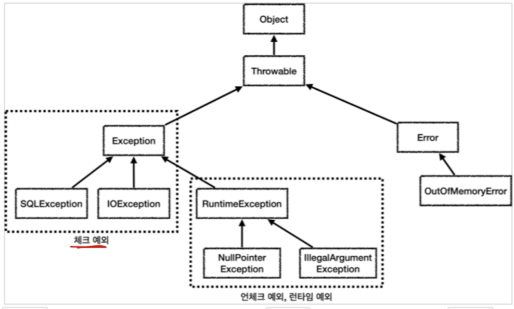
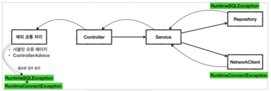

# 자바 예외 계층

## 예외 클래스 구조

## Throwable
최상위 예외

## Error
애플리케이션에서 복구 불가능한 시스템 예외.
개발자가 잡을 수 없는 예외다. 
언체크 예외에 속한다. 

## Exception
애플리케이션 로직에서 사용할 수 있는 실질적 최상위 예외.

기본적으로 체크 예외라고 생각하면 된다. 
컴파일러가 체크하기 때문에 체크예외이다. 

체크 예외는 기본적으로 **잡거나, 밖으로 던져야 컴파일 오류가 나지 않는다.** IDE에서 빨간 줄 생기는 걸 떠올리면 된다.

정상이 아닌 상황을 예외로 만든것이다. 
예외 또한 `의도적`이라 할 수 있다.

이미 예외가 발생할 것을 알고 있는 것이다.

#### 장점
컴파일 오류가 발생하기 떄문에 개발자가 실수로 누락할 일이 없다. 

#### 단점
작은 예외까지 항상 처리를 해줘야한다. 

리포지토리의 체크예외가 올라오면 비즈니스 계층에서 무조건 처리를 해줘야 한다. 하지만, 서비스에서 처리할 방법이 없다. Controller 역시 방법이 없어서 ControllerAdvice까지 올라간다.

또한, DB 기술이 JDBC에서 JPA로 변경되면 예외의 종류도 달라지기 때문에, 코드를 전부 변경해야 한다. 

이렇기 때문에, 런타임예외로 변경해서 던져주는 테크닉이 필요하다. 

런타임 예외는 throw 선언 생략이 가능하기 때문에, 코드를 변경할 일이 없어진다.

이런 해결 불가능한 예외는 로그를 남기고 별도 채널을 통해 개발자에게 전송되어야 한다. 

## RuntimeException
Exception에 속하지만 컴파일러 체크하지 못하는 언체크 예외이다. 

런타임 시점에 예외 확인되기 때문에 런타임 예외라고 많이 부른다.

throws 예외 선언이 없어도 자동으로 던져진다. 

#### 장점 
throws 생략이 가능해서 의존관계를 참조하지 않아도 된다.

#### 단점
런타임예외는 개발자가 실수로 누락할 수 있다.

## 언제 뭘 써야 되냐

기본적으로 런타임예외를 사용하자. 

체크 예외는 비즈니스 로직상 의도적으로 던지는 예외로만 사용하자.
ex) 계좌 이체 실패, 결제 포인트 부족, 로그인 실패. 

## 참고
https://velog.io/@new_wisdom/Exception

