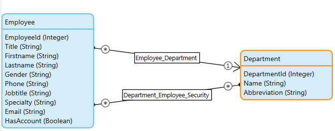
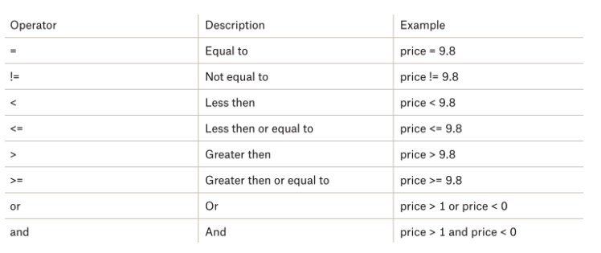
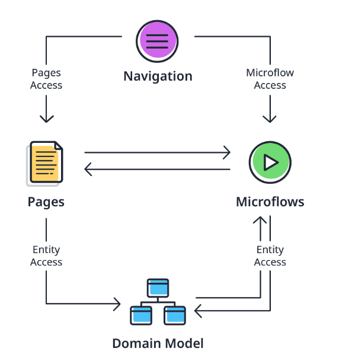
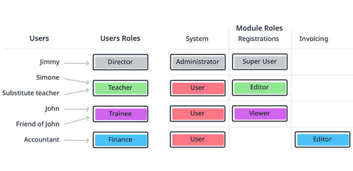
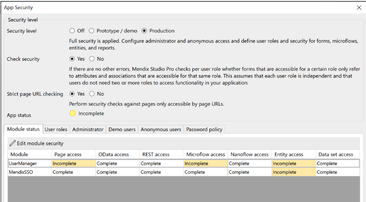

## Rapid Developer Certification Learning Path

## User story

* 포함되어야하는 항목
  * Which end-user does this apply to? <user type>
  * What do they need to accomplish? <business value>
  * How can I help them do that? <what>
* 최종형식
  * As a **user type** I want **what**, so that **business value**.

## json mapping
find an object by key를 설정해주자
중복되는 데이터가 들어가지 않음.

## non persistent data
client의 session 동안만 저장된다.

## Association 2개 해주기
For example, you can have a relationship between Department and Employee. A person may work in a department, but you also want to allow managers edit privileges within their departments without creating a separate Manager entity. A way to solve this would be to create two associations for that purpose and adjust the names of the associations accordingly. For example, Department_Employee_Security.

https://academy.mendix.com/link/modules/314/lectures/2376/5.5-Supported-Relations

## Entity 이름 규칙
1. 단수형
2. Pascal Case, for example, HousekeepingRecord or LogEntry. 언더바, 기호 쓰지 않기

## Attributes 이름 규칙
1. 가능하면 약어 쓰지 않기. 기술적 이유를 제외하고
2. Pascal Case, such as FirstName or TelephoneNumber.

## Page 이름 규칙

## Data View
single instance of an entity
allow nesting for association entities

## Data Grid
data in a table fashion
commonly used to display a list of objects.

## Temlate Grid
 shows a list of objects in a tile view.
 can use associations too

## List View
shows a list of objects.

## XPath Queries

ex) //Administrator.Account[UserManager.Employee_Account/UserManager.Employee/Firstname = 'Henry']

https://docs.mendix.com/refguide/xpath/

For example, the below will return all employee objects that have an account associated to them:

[UserManager.Employee/UserManager.Employee_Account] 

## Security

### Authorization

1. Project Security
   1. project level
   2. password policy같은 general setting

2. Module Security
   1. module level
   2. pages, microflows, entities 접근 setting
  
security configuration screens 혹은 각 properties에서 security 설정 가능

roles라는 컨셉을 통해 module security를 projec security에 연결 가능.

mendix security model은 크게 4개의 section으로 나눈다.

### App Security level 
always applied to your whole app
* Off
  * no security
* Prototype/Demo
  * prototype이 있을 때
  * login functionality, page access, and microflow and nanoflow access.
* Production
  * cloud 배포 전
  *  configure all aspects of security
  *  not be allowed to deploy your app to a licensed node in the Mendix cloud.

app security 와 module security로 나눌 수 있음.
App security는 general settings
Module security는 individual elements in module

module과 security를 같이 export, import 할 수 있다.

App security에서 User Roles를 만들어서 user에 할당할 수 있다. 

Module Security에서는 module roles를 만들어서 user roles에 할당할 수 있다.

* Module Status 
  * 전체 module security 상태를 확인할 수 있다.
* User roles 
  * user role을 만들고 수정할 수 있다. module role이랑 연결도 가능
* Administrator
  * initial user to log in
  * name, password, user role이 있어야 한다.
* Demo Users
  * security 설정이 제대로 되는지 확인해보고 싶을 때
  * demo user를 사용
* Anonymous users
  * user account 없는 사용자를 위해.
* password Policy
  * 비밀번호 규칙

* Module roles 
  * module role을 생성할 수 있다.
* Page access
  * navigation, link, button으로 접근할수 있는 모든 페이지 목록
* Microflow access
  * microflow가 button, link 또는 navigation menu에 부착된경우 여기에 뜬다.
* Nanoflow access
  * 상동
* Entity access
  * Entity도 access rule을 설정해줄 수 있다.
  * 여러개의 module rule이 결합될 수 있다.
  * object를 create/delete 권한을 role에 줄 수 있음.
  * 각 attribute에 read or read/write할 수 있는 권한도 줄 수 있음.

## System and Administration Module
* System Module
  * required module that you cannot edit. It is key to the functioning of Mendix and allows your users to log in. 
* Administration Module
  * provided to you by default and allows you to manage your local users. This module is editable and you can even remove it if you want to. However, the recommendation is to leave it where it is as it contains essential functionality to manage users. 