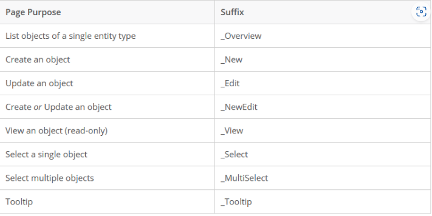

## Rapid Developer Certification Learning Path

## User story

* 포함되어야하는 항목
  * Which end-user does this apply to? <user type>
  * What do they need to accomplish? <business value>
  * How can I help them do that? <what>
* 최종형식
  * As a **user type** I want **what**, so that **business value**.

## json mapping
find an object by key를 설정해주자
중복되는 데이터가 들어가지 않음.

## non persistent data
client의 session 동안만 저장된다.

## Association 2개 해주기
For example, you can have a relationship between Department and Employee. A person may work in a department, but you also want to allow managers edit privileges within their departments without creating a separate Manager entity. A way to solve this would be to create two associations for that purpose and adjust the names of the associations accordingly. For example, Department_Employee_Security.

https://academy.mendix.com/link/modules/314/lectures/2376/5.5-Supported-Relations

## Entity 이름 규칙
1. 단수형
2. Pascal Case, for example, HousekeepingRecord or LogEntry. 언더바, 기호 쓰지 않기

## Attributes 이름 규칙
1. 가능하면 약어 쓰지 않기. 기술적 이유를 제외하고
2. Pascal Case, such as FirstName or TelephoneNumber.

## Page 이름 규칙

## Data View
single instance of an entity
allow nesting for association entities

## Data Grid
data in a table fashion
commonly used to display a list of objects.

## Temlate Grid
 shows a list of objects in a tile view.
 can use associations too

## List View
shows a list of objects.