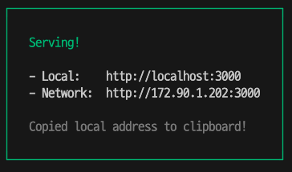
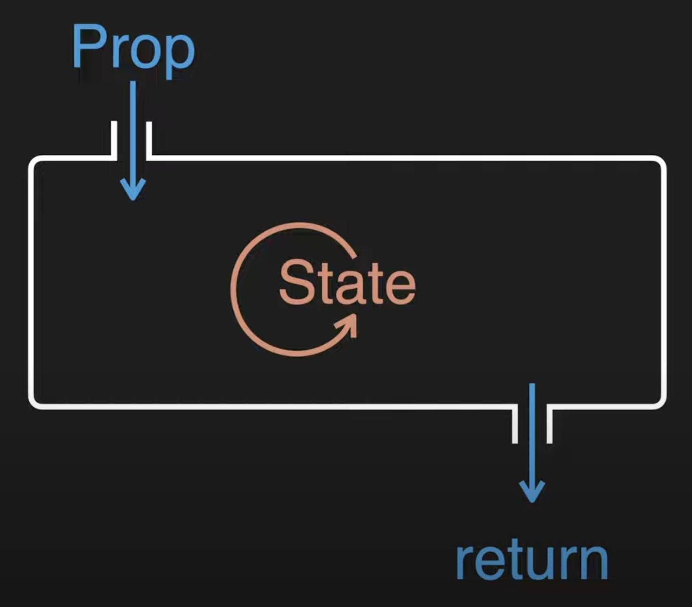
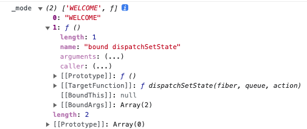

# React
[공식문서](https://ko.legacy.reactjs.org/)

## 핵심역할
사용자 정의태그를 만들어서 부품으로 사용한다.

## 로컬 세팅
새로운 React 앱 만들기 > 추천 툴체인(필요한 모든 환경을 제공하는 편리한 도구들) > Create React App
[Create React App](https://create-react-app.dev/)

1. node.js 설치

2. 해당 폴더에서 명령 실행
~~~sh
npx create-react-app .
~~~

3. 리액트 구동
~~~sh
npm start
~~~

## 리액트 구조
### src
`index.js `
입구 파일.
여러가지 전역적인 설정이 들어간다.

npm start로 리액트 앱을 구동시키면, index.js를 찾고 적혀있는대로 동작

`<App />`
이 코드가 UI 코드인데, 실제 내용은 어디있냐면
위에서 `import App from './App';`에서 가져오고 있음. 참고로 .js 확장자명은 생략된 것이다.

`App.js`의 function App()의 return값인 HTML 코드가 실제 화면의 소스와 일치한다.

그리고 `App.js`는 `import './App.css';`를 통해 css를 import 한다.

저 root의 출처는 아래이다.
~~~js
const root = ReactDOM.createRoot(document.getElementById('root'));
root.render(
  <React.StrictMode>
    <App />
  </React.StrictMode>
);
~~~
import한 `<App/>`을 id값이 **root**인 태그로 렌더링되라는 코드가 있다.

`public/index.html`을 보면 아래 코드가 있다.
~~~html

~~~

## 배포
~~~sh
npm run build
~~~
배포본을 만드는 명령어

build 폴더가 생긴다. index.html 폴더를 보면 공백 조차 없다. 배포할 때는 최대한 용량을 줄이기 위해서.

~~~sh
npx serve -s build
~~~
serve(web server)라는 앱을 쓰도록 권장함. node.js로 만들어졌다.
-s 옵션 : 사용자가 어떤 경로로 들어오든지, index.html을 서비스 해줌
build 폴더 지정 : build 폴더 안에 있는 index.html을 서비스

## Component(사용자 정의 태그) 만들기
~~~js
function Test(){ //대문자로 시작하기
  return HTML 코드
}
~~~

사용할 때는 
~~~js
<Test></Test>
또는
<Test/>
~~~

여러 태그들을 부품으로 만들 수 있게 되었다.

## PROP(속성)을 가진 Component
~~~js
function Header(props){
  console.log('props', props, props.title);
  return <header>
    <h1><a href="/">{props.title}</a></h1>
  </header>
}

<Header title="REACT"></Header>
~~~
Component 함수에 parameter를 준다. 이름은 마음대로 할 수 있지만 보통 props를 쓴다.

console을 찍어보면 객체가 들어온다.

값을 가져오기 위해 {} 표현식을 쓴다.

`key` PROP
리액트가 자동으로 생성한 태그를 추적할 근거.
약속된 PROP. Unique한 값을 줘야 한다.

## 이벤트 기능
컴퍼넌트의 PROP의 값으로 함수를 전달한다.

~~~js
<Header title="REACT" onChangeMode={()=>{
  alert('Header');
}}></Header>
~~~ 
해당 컴퍼넌트를 클릭했을 때, 해당 함수의 내용이 실행되도록 하길 원한다.

~~~js
<header>
  <h1><a href="/" onClick={(event)=>{
    event.preventDefault();
    props.onChangeMode();
  }} >{props.title}</a></h1>
</header>
~~~
> 안에 있는 a태그는 유사HTML이다. 리액트 개발환경이 브라우저가 이해할 수 있는 HTML로 컨버팅해주는 것이랑 문법이 다를 수 있다.
> onClick={}로 사용

> **event**
> call back 함수에 리액트는 event 객체를 첫번 째 파라미터로 주입해준다. 이벤트 상황을 제어할 수 있는 여러 정보와 기능이 있다.

> **event.preventDefault()**
> a 태그의 기본동작을 방지한다. 즉, 클릭해도 reload안됨.

해당 컴포넌트 안에서 prop에 담겨있는 함수를 받아서 onClick시 수행할 함수로 넣어준다.

## State

prop과 마찬가지고 state도 값이 변경되면 새로운 return값을 만들어서 UI를 만든다.

Prop : 컴포넌트를 사용하는 외부자를 위한 것.
State : 컴포넌트를 만드는 내부자를 위한 것.

### 사용법

~~~js
import {useState} from 'react';
~~~
useState함수를 import

~~~js
const _mode = useState('WELCOME');
~~~
`useState()`함수를 사용해서 상태를 만듦.

_mode를 로그로 찍어보면 

useState()는 배열을 return 한다.

0번째 원소는 상태의 값.
1번째 원소는 상태의 값을 변경할 때 쓰는 함수.

~~~js
const mode = _mode[0];
const setMode = _mode[1];
~~~

~~~js
const [mode, setMode] = useState('WELCOME');
~~~
축약해서 한번에 배열로 받아준다.

~~~js
setMode('READ');
~~~
값을 바꿀 때는 setMode()사용.

setMode()가 호출돼서 state 값이 바뀌면, 컴포넌트가 다시 실행된다.
그러면 useState가 값을 재설정한다.

