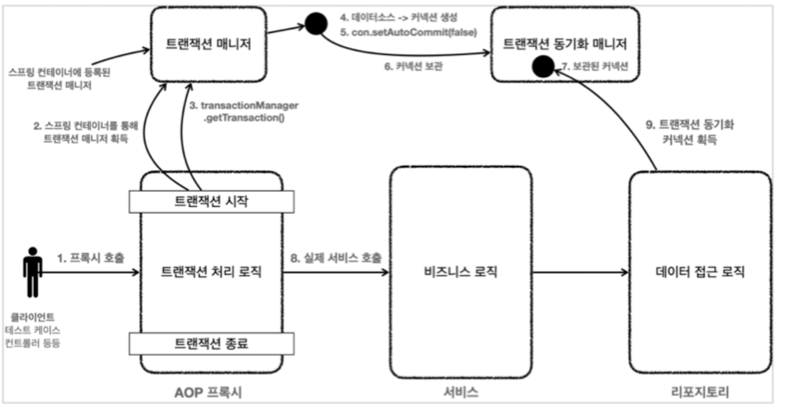

## TransactionSynchronizationManager

트랜잭션 동기화 매니저.

ThreadLocal을 사용해서 커넥션을 동기화.
트랜잭션 매니저가 내부에서 동기화매니저를 호출한다.

동작방식
트랜잭션 매니저가 커넥션을 시작하면, 트랜잭션 동기화 매니저에 보관한다. 
리포지토리가 동기화 매니저에 보관된 커넥션을 사용한다.

커넥션 호출
~~~java
DataSourceUtils.getConnection()
~~~
위 메서드 내부에서 transactionsynchronizationmanager를 사용
동기화 매니저 내부에 있는 커넥션을 꺼내옴. 없으면 새로 만듦.

커넥션 반환
~~~java
DataSourceUtils.releaseConnection()
~~~
커넥션을 종료시키는 것이 아니라, 동기화 매니저에 돌려줌.

## TransactionTemplate
비즈니스 로직에서 반복되는 try cath commit rollback을 템플릿 콜백 패턴으로 만들어주는 템플릿 클래스

~~~java
this.txTemplate = new TransactionTemplate(transactionManager);
~~~
transactiontemplate은 주입받은 PlatformTransactionManager를 가지고 만든다.

## @Transactional
스프링AOP를 통해 프록시 도입.
서비스 계층에 여전히 남아있는 트랜잭션 코드를 없애기 위해.

@Transactional을 쓰더라도 내부에서 
DataSource, PlatformTransactionalManager 모두 빈 등록이 필요하다.

@Transactional을 테스트코드에서 쓰면, 각 테스트가 완료 후, 자동으로 트랜잭션을 롤백시켜버린다.

## DataAccessException

RuntimeException을 상속한 예외 클래스

각 DB 기술마다 서로 다른 예외를 추상화 하였다. 

Transient와 NonTransient로 구분

## SQLExceptionTranslator

DB에서 발생한 오류 코드를 스프링이 정의한 예외로 자동으로 변환해주는 변환기 역할.

sql-error-code.xml에서 에러코드를 참고한다. 