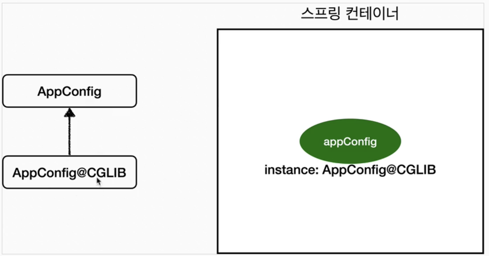
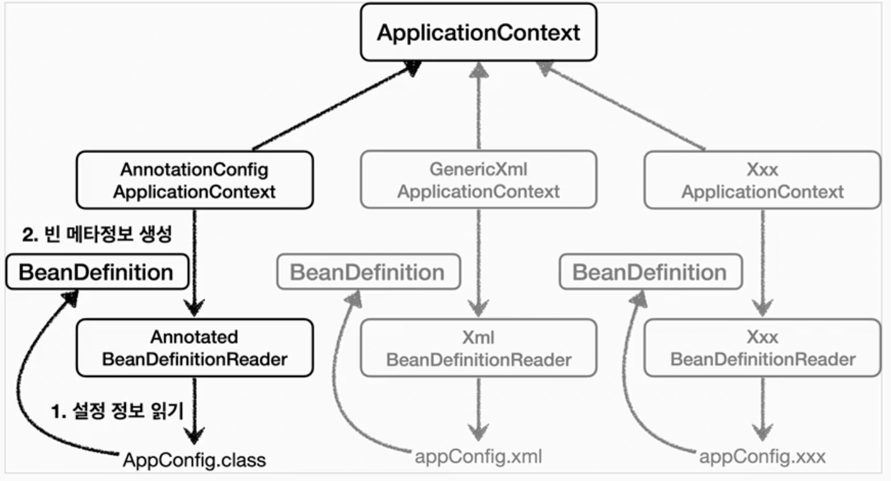

# Spring Container

## 스프링 컨테이너 
Spring Container는 스프링 프레임워크의 IoC Container 이다.

스프링 빈의 인스턴스화, 구성, 조립, 생명주기 관리의 역할을 한다.

## 관련 Class

#### @Configuration
애플리케이션 설정정보 클래스에 적어주는 애노테이션.

Spring은 이제 이 클래스를 설정정보로 인식.

구성정보 클래스 역시 스프링 빈으로 등록된다.

> @Configuration이 스프링 컨테이너에 등록될 때, `CGLIB`를 사용해서 상속받은 임의의 클래스를 빈으로 등록시켜 버린다.
>
> `CGLIB`를 사용해서 바이트 코드를 조작하고, 싱글톤이 보장되도록 한다.

#### @Bean
스프링 컨테이너는 `@Configuration` 클래스 내에 있는 `@Bean`이 적힌 method들을 모두 호출해서 return된 객체를 `스프링 컨테이너`에 등록한다.

>만약 `@Configuration`없는 클래스에 `@Bean`만 있다면 스프링 빈으로 등록은 되지만, 싱글톤을 보장하지는 않는다.

이렇게 스프링 컨테이너에 등록된 객체를 `스프링 빈`이라고 한다.

이때, 스프링 빈의 이름은 method명과 동일하게 등록된다.

`@Bean(name="aaa")`를 사용하면, 스프링 빈 이름을 메소드명과 다르게 등록할 수 있다. **하지만, 모든 스프링 빈의 이름은 중복되어서는 안된다.**

>static이 붙은 method는 싱글톤이 적용되지 않는다.

~~~java
@Configuration
public class AppConfig {
    @Bean
    public MemberService memberService() {
        return new MemberServiceImpl(memberRepository());
    }
    @Bean
    public MemberRepository memberRepository() {
        return new MemoryMemberRepository();
    }
}
~~~

#### BeanFactory
스프링 컨테이너 최상 interface

기본적인 스프링 빈 조회 기능

#### ApplicationContext
`Spring Container` interface
스프링 컨테이너

여러가지 부가기능을 제공한다.

대부분, ApplicationContext를 사용한다.

#### BeanDefinition

스프링 빈 설정 메타정보
`@Bean`, `<bean>` 당 각각 하나씩 메타 정보가 생성됨. 

스프링 컨테이너는 이 메타정보를 기반으로 스프링 빈을 만든다. 따라서, 스프링 빈이 자바 코드인지, XML인지 몰라도 된다.

#### AnnotationConfigApplicationContext
애노테이션 기반 자바 설정 클래스 일 때 사용

`ApplicationContext`의 구현체

~~~java
ApplicationContext ac = 
new AnnotationConfigApplicationContext(AppConfig.class);
~~~
등록할 @Configuration 클래스를 적어준다.

이러면, 스프링이 @Configuration 클래스 내의 @Bean을 모두 Spring Container에 등록하고 관리해준다.

~~~java
ac.getBean("memberService", MemberService.class);

ac.getBean(MemberService.class);
~~~
Spring Container에서 Bean을 가져올 때 사용.
가져올 Bean의 이름과 객체 반환타입을 적어준다.

가져올 스프링 빈의 타입만으로도 조회가 가능하다. 단, 같은 타입의 빈이 여러개 일 경우에는 다른 방법을 써야 한다.

----

~~~java
String[] beanDefinitionNames = ac.getBeanDefinitionNames();

Object bean = ac.getBean(beanDefinitionName);
~~~
스프링에 등록된 모든 스프링 빈 이름 조회.

스프링 빈 이름으로 스프링 빈 조회

-----

~~~java
Map<String, MemberRepository> beansOfType =
                ac.getBeansOfType(MemberRepository.class);
~~~
특정 타입의 스프링 빈 모두 조회

> 참고로 부모 타입으로 조회하면, 자식 타입도 모두 조회된다.

이때는, beansOfType()을 쓰거나, 스프링 빈 이름을 지정하거나, 구현체 타입으로 조회하면 된다.

#### @ComponentScan
컴포넌트 스캔

설정정보가 없어도 자동으로 스프링 빈을 등록하는 기능

`@Component`가 붙은 클래스를 다 스프링 빈으로 등록해준다. (@Configuration 안에도 @Component가 있어서 자동 등록 됐던 것)

>빈의 이름은 @Component가 붙은 클래스 이름의 첫글자를 소문자로 바꿔서 사용한다.

~~~java
@ComponentScan(
 basePackages = "hello.core",
}
~~~
스캔할 패키지를 지정해줄 수 있다. 해당 패키지와 하위 패키지만 스캔.

지정하지 않으면, 현재 패키지와 하위 스캔. 이 방법이 default

사실 `@SpringBootApplication`에 @ComponentScan이 들어있어서 따로 쓸일은 없다.

##### 스캔 대상
@Component
@Controller
@Service
@Repository
@Configuration

#### @AutoWired
기존에는 @Configuration에서 의존관계 설정을 다 해줬는데, @ComponentScan과 @Component를 쓰면 어디서 의존관계를 설정(어떤 구현체를 주입?)해주게 되는지 모른다.

이때 사용하는 것이 @AutoWired

스프링 컨테이너가 타입에 맞는 스프링 빈을 찾아와서 의존관계 주입을 자동으로 해준다.

같은 타입이 여러개면 오류가 나는데?!

#### @SpringBootApplication
@Configuration, @EnableAutoConfiguration,@ComponentScan이 합쳐진 애노테이션

SpringApplication.run()이 구동되면, 해당 위치의 패키지와 하위패키지를 모두 스캔한다.

run()내부에서 스프링 컨테이너가 생성된다.

스프링 애플리케이션의 컨텍스트를 생성하는데 사용.

## 스프링 컨테이너 생성과정
1. 스프링 컨테이너가 생성 될 때, 구성정보(@Configuration)이 지정되어야 한다. 하나의 스프링 컨테이너 안에, 여러 구성정보가 들어갈 수 있다.
2. 스프링 컨테이너는 @Bean을 모두 호출해서 return 객체들을  스프링 빈으로 등록한다.
3. 구성정보를 참고해서 스프링 빈 DI를 한다.

## 스프링 컨테이너 특징

#### 싱글톤 컨테이너
스프링 컨테이너는 싱글톤 패턴의 문제점을 해결하면서, 스프링 빈을 하나만 생성한다.

싱글톤 객체를 생성하고 관리하는 싱글톤 레지스트리 역할을 한다.

#### 스프링 컨테이너 저장 영역 
스프링 컨테이너와 스프링 빈은 모두 결국 객체이기 때문에 `heap` 영역에 생성된다. 

하지만, 싱글턴 빈은 스프링 컨테이너가 참조하고 있고, 스프링 컨테이너도 애플리케이션 어디선가 계속 참조하고 있기 때문에 GC의 대상이 되지않고 종료직전까지 사라지지 않는다.(GC의 대상이 되려면 참조하는 포인터가 없어야 하기 때문에)

## 스프링 컨테이너의 장점

## 참고
https://www.nextree.co.kr/p11247/

[baeldung](https://www.baeldung.com/spring-application-context)