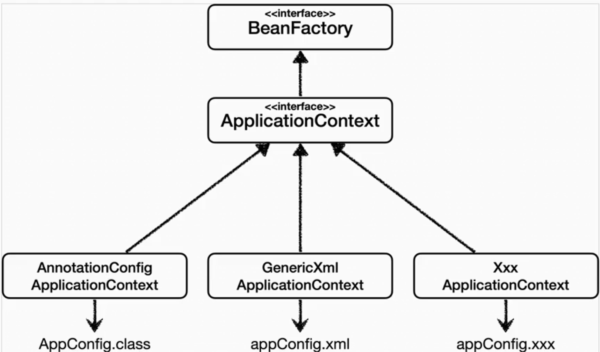
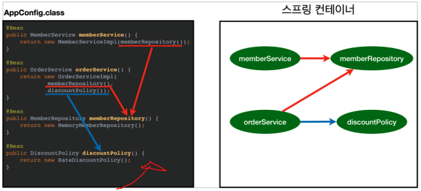

# Spring Container

## 스프링 컨테이너 
Spring Container는 DI Container의 한 종류라고 할 수 있다.

## 관련 Class

### @Component

### @Configuration
애플리케이션 설정정보 클래스에 적어주는 애노테이션.

Spring은 이제 이 클래스를 설정정보로 인식.

구성정보 클래스 역시 스프링 빈으로 등록된다.

### @Bean
스프링 컨테이너는 `@Configuration` 클래스 내에 있는 `@Bean`이 적힌 method들을 모두 호출해서 return된 객체를 `스프링 컨테이너`에 등록한다.

이렇게 스프링 컨테이너에 등록된 객체를 `스프링 빈`이라고 한다.

이때, 스프링 빈의 이름은 method명과 동일하게 등록된다.

`@Bean(name="aaa")`를 사용하면, 스프링 빈 이름을 메소드명과 다르게 등록할 수 있다. **하지만, 모든 스프링 빈의 이름은 중복되어서는 안된다.**

~~~java
@Configuration
public class AppConfig {
    @Bean
    public MemberService memberService() {
        return new MemberServiceImpl(memberRepository());
    }
    @Bean
    public static MemberRepository memberRepository() {
        return new MemoryMemberRepository();
    }
}
~~~

### BeanFactory
스프링 컨테이너 최상 interface

기본적인 스프링 빈 조회 기능

### ApplicationContext
`Spring Container` interface
스프링 컨테이너

여러가지 부가기능을 제공한다.

대부분, ApplicationContext를 사용한다.

### BeanDefinition

스프링 빈 설정 메타정보
@Bean, <bean> 당 각각 하나씩 메타 정보가 생성됨. 

스프링 컨테이너는 이 메타정보를 기반으로 스프링 빈을 만든다. 따라서, 스프링 빈이 자바 코드인지, XML인지 몰라도 된다.

### AnnotationConfigApplicationContext
애노테이션 기반 자바 설정 클래스 일 때 사용

`ApplicationContext`의 구현체

~~~java
ApplicationContext ac = 
new AnnotationConfigApplicationContext(AppConfig.class);
~~~
등록할 @Configuration 클래스를 적어준다.

이러면, 스프링이 @Configuration 클래스 내의 @Bean을 모두 Spring Container에 등록하고 관리해준다.

~~~java
ac.getBean("memberService", MemberService.class);

ac.getBean(MemberService.class);
~~~
Spring Container에서 Bean을 가져올 때 사용.
가져올 Bean의 이름과 객체 반환타입을 적어준다.

가져올 스프링 빈의 타입만으로도 조회가 가능하다. 단, 같은 타입의 빈이 여러개 일 경우에는 다른 방법을 써야 한다.

----

~~~java
String[] beanDefinitionNames = ac.getBeanDefinitionNames();

Object bean = ac.getBean(beanDefinitionName);
~~~
스프링에 등록된 모든 스프링 빈 이름 조회.

스프링 빈 이름으로 스프링 빈 조회

-----

~~~java
Map<String, MemberRepository> beansOfType =
                ac.getBeansOfType(MemberRepository.class);
~~~
특정 타입의 스프링 빈 모두 조회

> 참고로 부모 타입으로 조회하면, 자식 타입도 모두 조회된다.
>
이때는, beansOfType()을 쓰거나, 스프링 빈 이름을 지정하거나, 구현체 타입으로 조회하면 된다.

## 스프링 컨테이너 생성과정
1. 스프링 컨테이너가 생성 될 때, 구성정보(@Configuration)이 지정되어야 한다. 하나의 스프링 컨테이너 안에, 여러 구성정보가 들어갈 수 있다.
2. 스프링 컨테이너는 @Bean을 모두 호출해서 return 객체들을  스프링 빈으로 등록한다.
3. 구성정보를 참고해서 스프링 빈 DI를 한다.

## 스프링 컨테이너 저장 영역 
스프링 컨테이너와 스프링 빈은 모두 결국 객체이기 때문에 `heap` 영역에 생성된다. 

하지만, 싱글턴 빈은 스프링 컨테이너가 참조하고 있고, 스프링 컨테이너도 애플리케이션 어디선가 계속 참조하고 있기 때문에 GC의 대상이 되지않고 종료직전까지 사라지지 않는다.(GC의 대상이 되려면 참조하는 포인터가 없어야 하기 때문에)

## 스프링 컨테이너의 장점

## @SpringBootApplication
@Configuration, @EnableAutoConfiguration,@ComponentScan이 합쳐진 애노테이션

SpringApplication.run()이 구동되면, 해당 위치의 패키지와 하위패키지를 모두 스캔한다.

run()내부에서 스프링 컨테이너가 생성된다.

스프링 애플리케이션의 컨텍스트를 생성하는데 사용.

## 참고
https://www.nextree.co.kr/p11247/