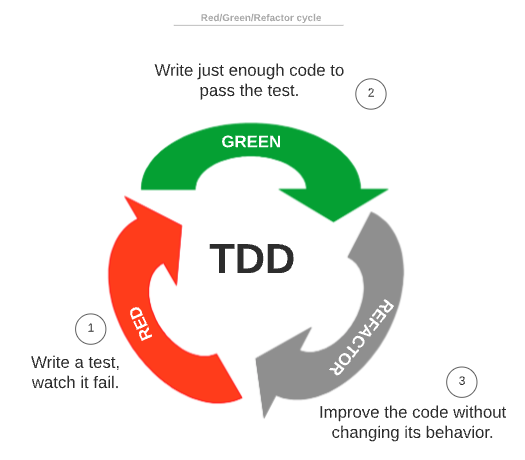

# TDD(Test-Driven Development)

## 정의
테스트 주도 개발

`Unit Test(단위 테스트)`를 실제 코드보다 먼저 작성하는 소프트웨어 개발방식

즉, 기능 구현 전에 요구사항의 단위테스트를 먼저 작성하는 것.

### Test
시험?

애초에 현실에서의 시험의 목적은 아냐 모르냐 확인.

개발에서의 Test는?
의도한대로 만들어진 코드가 맞는지 확인.

`Requirement(요구사항)` -> Intent(의도) -> Objective(목표)

요구사항을 효율적으로 해결하기 위함을 생각하는 것이 개발자의 목표다.

요구사항이 핵심이다.

### Driven
Test가 끌고가는 개발.

## 목표
개발자가 문제와 해당 도메인을 분석하고 이해하는 데 더 많은 시간을 소비하기 전에 적절한 단위 테스트를 작성한다.

이를 통해서, 코드가 모든 요구 사항과 고객의 요구를 충족할 가능성이 더 높아진다.

## 개념
요구사항에 집중하는 개발 방식.

작은 요구사항을 쪼개서 테스트한다.

TDD는 오로지 `구현 프로세스(implementation process)`에만 집중한다. (BDD와 다른 부분)

TDD의 문서는 테스트 코드 그 자체라고 할 수 있다.

Unit Test보다 더 광범위한 개념

Agile 중에 하나.

## Red/Green/Refactor

TDD 개발 싸이클.

>RED

필요한 기능의 일부에 대해서 테스트 코드를 작성한다.
   
기능이 아직 구현되지 않았기 때문에, 해당 테스트는 무조건 실패할 것이다.

만약, 테스트가 통과한다면 오히려 잘못 작성된 것이다.

IDE에서는 실패 메세지를 빨간색으로 보여주기 때문에, 이 단계를 `RED`라고 부르게 되었다.

> GREEN

테스트가 통과되도록 최소한의 코드를 작성한다.

이 단계에서의 코드 품질은 중요하지 않다. 

오직, 테스트를 통과시키기 위해 빠르고 최소한으로 작성되는 것이 중요하다.

> REFACTOR

리팩토링 단계.

기능의 수정없이 코드의 품질을 향상시킨다.

리팩토링 단계에서, 테스트를 자주 수행해야 오류를 잘 찾을 수 있다.

이 단계 이후에도, 테스트는 여전히 통과되는 상태여야 한다.

## 출처
https://www.baeldung.com/cs/unit-testing-vs-tdd

https://www.baeldung.com/cs/bdd-guide#tdd
